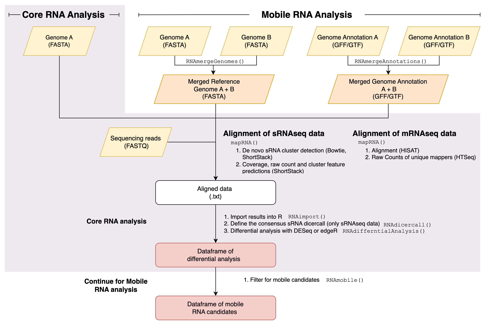

mobileRNA <a href="kjeynescupper.github.io/mobileRNA/"></a>
======================================================================
An `R` package for analysis of sRNA & mRNA populations in plants and animals. Specalised in the identification of populations in systems with molecules produced by two different genotypes, such as plant graft systems. 

<br> 

<!-- badges: start -->
[](https://github.com/KJeynesCupper/mobileRNA/actions)
<!-- badges: end -->


Table of Contents
======================================================================
-   [Overview](#Overview)
-   [Installation](#installation)
-   [Quick Start](#Quick-Start)
-   [Output](#Output)
-   [Advanced Analysis](#Advanced-Analysis)
<br>

Overview
======================================================================

**mobileRNA** is an `R` package that provides a pipeline for 
pre-processing and analysis of small RNA (sRNA) and messenger RNA (mRNA) 
sequencing data, primarily for the identification of mobile RNAs in plant graft 
systems. But, likely has other applications for systems containing more than 
one genotype, such as dual-host systems, to identify RNA molecules produced by 
each genotypes. **mobileRNA** also supports routine treatment vs control 
analysis to identify changes in sRNA population (abundance & production). These 
two workflows have be separated as mobile RNA analysis & the core RNA analysis, 
respectively [(Figure 1)](https://github.com/KJeynesCupper/mobileRNA/blob/main/man/figures/mobileRNA_graphic_1.png).

Most available genomics approaches to identify RNA molecules produced by two
different genotypes in a biological sample involve the alignment on a genotype 
of reference and post alignment screening of genetic variants. These methods 
have many possible limitations. **mobileRNA** aims to circumvents such problems 
with an alignment step which is simultaneously performed on both genomes 
involved. This approach considers that alignment tools already implement an 
algorithm ideal for identifying the best matches of reads to a given genome 
reference, but they do not account for potential matches to DNA sequences which 
are not provided as reference. The downstream analysis allows for differential 
analysis for the comparison in abundance, the identification of changes in RNA
production and the identification of putative mobile RNA molecules via
the filtering of RNA molecules which uniquely map to the mobile genome
of to the other grafting partner involved, which would represent the
putative mobile RNA molecules.

<br>

<p>
    
</p>

**Figure 1: Basic diagram of mobileRNA workflows.**


<br> 

Installation 
======================================================================
The latest version of the package can be install directly from this
GitHub repo:

``` r

if (!require("devtools")) install.packages("devtools")
devtools::install_github("KJeynesCupper/mobileRNA", ref = "main")

```
To install from Bioconductor:
``` r

if (!require("BiocManager", quietly = TRUE))
    install.packages("BiocManager")
BiocManager::install("mobileRNA")

```
Load package into R library:
``` r

library(mobileRNA)

```
<br>

Quick Start for mobile sRNA analysis
======================================================================
The example data set included with **mobileRNA** simulates grafting
between eggplant and tomato where the scion is eggplant and tomato
is the rootstock. There is example mRNAseq and sRNAseq files which represent
samples taken from an eggplant leaf tissue. Here we will locate sRNA
produced by the tomato rootstock which have traveled into the eggplant leaves

<br>

## 1. Merging genome assemblies

Merge the FASTA genome assemblies of tomato and eggplant into a single
reference file stored in your desired directory.

```r
fasta_1 <- system.file("extdata","reduced_chr12_Eggplant.fa", 
                       package="mobileRNA")

fasta_2 <-system.file("extdata","reduced_chr2_Tomato.fa",
                      package="mobileRNA")
# define temporary output directory - replace with your directory
output_assembly_file <- file.path(tempfile("merged_assembly", 
                                           fileext = ".fa"))

# merge
merged_reference <- RNAmergeGenomes(genomeA = fasta_1,
                                    genomeB = fasta_2,
                                    output_file = output_assembly_file)
```

<br>

## 2. Alignment

Align sRNA sequencing reads to the merged genome using our unique
alignment pipeline wrapped by the `mapRNA()` function.

``` r
samples <- system.file("extdata/sRNAseq",package="mobileRNA")

output_location <- tempdir()

mapRNA(input = "sRNA",
       input_files_dir = samples, 
       output_dir = output_location, 
       genomefile = output_assembly_file,
       condaenv = "/Users/user-name/miniconda3/envs/ShortStack4",
       mmap = "n")

```

<br>

## 3. Import pre-processed data into R

Import the results from the alignment step into R using the
`RNAimport()` function. This requires the directory storing the sample
output folders and the same of the samples to import from the directory.

``` r
# Directory containing results
results_dir <-  file.path(output_location,"2_alignment_results")

# Sample names and total number of reads, in the same order. 
sample_names <- c("selfgraft_demo_1", "selfgraft_demo_2", "selfgraft_demo_3",
              "heterograft_demo_1", "heterograft_demo_2", "heterograft_demo_3")


sRNA_data <- RNAimport(input = "sRNA", 
                       directory = results_dir,
                       samples = sample_names)
                           
```

Now lets use the comprehensive dataset, load the pre-processed data:

```{r Load, message=FALSE}

data("sRNA_data")

```

<br>

## 4. Calculate the consensus dicercall

For a given sRNA cluster, each replicate has determined the dicercall,
also known as the sRNA class, based on the length in nucleotides of the
most abundant sRNA. This can be drawn from all samples or named samples.
The output can be used as threshold values for downstream analysis, and
to remove data noise depending on data quality.

``` r

sRNA_data_summary <- RNAdicercall(data = sRNA_data, tidy = TRUE )
```

<br>

## 5. Differential analysis of sRNA population

Undertake differential analysis of sRNA within the experimental design
to explore changes in abundance. The function allows for two methods;
`edgeR` or `DESeq`.

``` r
## sample conditions in order within dataframe
groups <- c("Selfgraft", "Selfgraft", "Selfgraft", 
            "Heterograft", "Heterograft", "Heterograft")


## Differential analysis of whole dataset: DESeq2 method 
sRNA_DESeq2 <- RNAdifferentialAnalysis(data = sRNA_data,
                                       group = groups,
                                       method = "DESeq2")
                              


                              
# save output as txt file 
write.table(sRNA_DESeq2, "./sRNA_DA_output.txt")

```

Summarise results:

```r

RNAsummary(sRNA_DESeq2)

```

How about summarizing the sRNA population which are statistically
significant:

``` r

RNAsummary(sRNA_DESeq2, alpha=0.05)

```

## 6. Identify putuative mobile sRNA

Select the putative mobile sRNA clusters using `RNAmobile()`. This
requires supplying the function with a unique identifier of the
rootstock genome. The merging step placed the prefix "B" to the tomato
chromosomes.

``` r
# define control samples
controls <- c("selfgraft_1", "selfgraft_2", "selfgraft_3")

mobile_sRNA <- RNAmobile(input = "sRNA",
                         data = sRNA_DESeq2, 
                         controls = controls,
                         genome.ID = "B", 
                         task = "keep")


# save output as txt file 
write.table(mobile_sRNA, "./sRNA_mobile_output.txt")

```

<br>

Output
======================================================================
A data frame where rows represent potential mobile sRNA clusters. The
columns include information on the cluster, individual sample
replicates, and more.

#### Information on the cluster:

-   `Locus`: Name of the chromosome or scaffold, start position & end
    position
-   `chr`: Name of the chromosome or scaffold
-   `start` : Start position of the cluster
-   `end` : End position of the cluster

#### Information on each sample replicate:

-   `Cluster`: Cluster Name
-   `Dicercall` : The size of most abundant small RNA size
-   `Count` : Number of reads, default is uniquely aligned (*e.g.* not
    multi-mapping).
-   `MajorRNA` : RNA sequence of the most abundant sRNA in cluster
    within the sample
-   `RPM` : Reads per Million
-   `FPKM` : Fragments Per Kilobase of transcript per Million

#### Other information

-   `DicerConsensus` : Consensus sRNA class
-   `DicerCounts` : Number of replicates which contributed to the
    consensus dicercall sRNA class
-   `CountMean` : Count mean (Calculated by `RNAdifferentialAnalysis()`)
-   `log2FoldChange` : Log2FoldChange--The effect size estimate
-   `pvalue` : P value, the probability under the assumption of no
    effect or no difference, of obtaining a result equal to or more
    extreme than what was actually observed
-   `padjusted` : A p-value adjustment
-   `logCPM` : log counts per million, measure of expression level <br>

<br>

Mobile mRNA Analysis
======================================================================
For the identification of mobile mRNA, the same `mobileRNA` workflow can be
used. For the alignment step, as well as using a merged genome assembly file
(FASTA) the user will also need to generate a merged genome gene annotation file
(GFF) with the same chromosome labels. As well as a dataframe contain 
sample data where rows represent samples, and column 1 stores the sample names, 
column 2 stores the fastq file name for mate 1 and, for pair-end alignment, 
column 3 stores the fastq file name for mate 2. While for all other downstream 
functions simply change some of the parameters to set the option to mRNA input 
data type. 

<br>

Advanced Analysis
======================================================================
The quick start analysis allows for the retrieval of a data frame the
sRNA total population in the experimental design and also the candidate
mobile sRNAs. Users may want to advance the analysis and plot the data:

-   Exploratory and quality control analysis, such as PCA and distance
    matrices.
-   Summary values including RPM mean and Count mean across specific
    samples.
-   Plotting of the distribution of sRNA classes and the consensus
    dicercall across individual replicates or across the data set.
-   Volcano plot for mRNA data 


Advanced features also include tools to assist functional analysis: 

* Identify genomic features associates with the sRNA clusters (ie. to explore the RNA expression of sRNA-producing genes in parallel analysis)
* Extract consensus RNA sequence for target prediction analysis

<br>
<br>

*Last updated:* 18-10-2023
