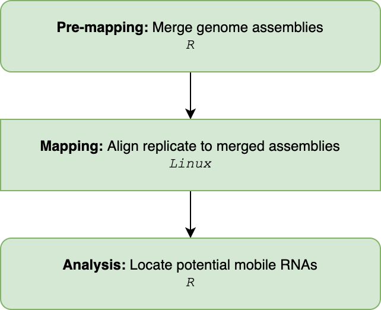
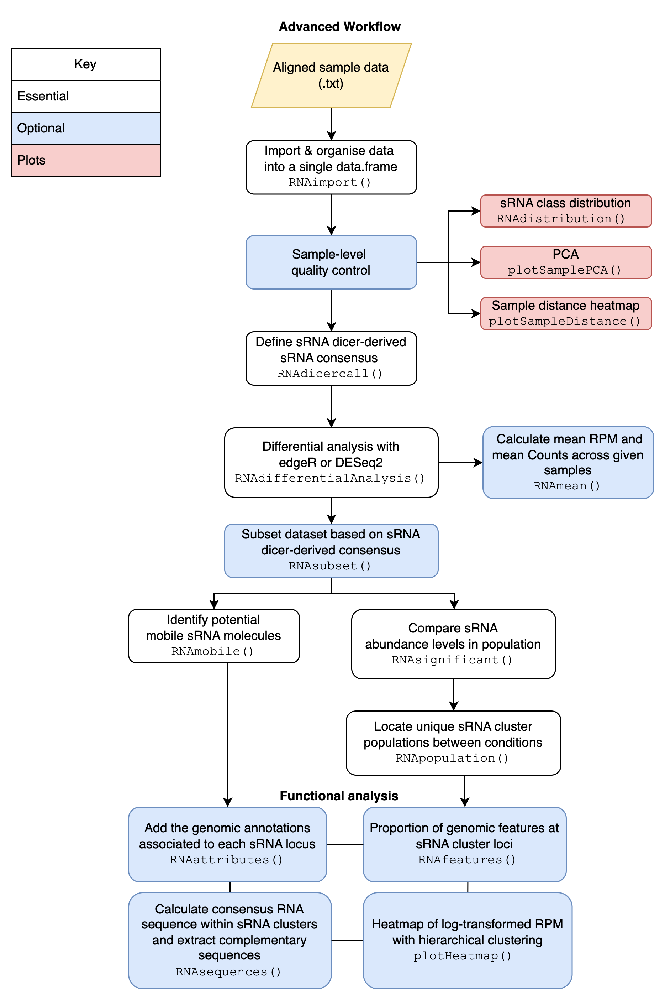

<br>
```{r setup, include = FALSE}
knitr::opts_chunk$set(
  collapse = TRUE,
  fig.align='center',
  external=TRUE,
  echo=TRUE,
  warning=FALSE,
  comment = "#>"
)
library(magrittr)
```

 
# Introduction
In plants, systemic signalling is an elaborated molecular system which
coordinates plant development, integrating and transmitting the information 
perceived from environment to distant organs. An important role in 
long-distance signalling is played by small RNA molecules (sRNAs). These 
endogenous sRNAs can be produced in a tissue and then transported
systemically across the vascular system into recipient organs, where they can
induce a molecular response and coordinate physiological changes. Plant grafting
can be utilsed to create chimeric plant systems composed of two genotypes. For 
example, grafting can join tomato and eggplant or different species of 
grapevine. Grafting of horticultural crops can lead to favorable traits, such 
as improved plant vigour or architecture, and resistance to stress. sRNAs have
been known to move across a graft junction, hence, understanding the complex
regulatory networks controlled by sRNAs traveling from different genomes could
assist the development of novel methods for transferring traits into crops, as
alternatives to traditional breeding or transgenic approaches.

To identify sRNA population which are mobile or native, analysts currently adopt 
and adapt a general RNA sequencing pipeline. Several genomic 
studies have used grafting to explore and characterise mobile sRNAs in chimeric 
systems, however, it is clear that there is not a  standardised approach.

Here we introduce the R Package mobileRNA, a recommend pipeline and analysis 
workflow for the exploration and identification of mobile small RNAs for 
chimeric systems and small RNA population changes between treatment and 
condition of non-chimeric systems. The pipeline offers an optimised 
mapping/alignment of samples to genome assemblies to improve sRNA origin, and 
offers analysis steps to remove mapping errors, visualization of the 
results, and supports output for functional analysis. 
<br>

# Methods
This manual offers a pipeline for the analysis of sRNAseq data taken from 
chimeric systems. For example, plant grafting experiments between different 
cultivars and species (with distinct genome assemblies). This pipeline involves
pre-processing and analysis steps for the identification of candidate mobile 
sRNA molecules and the exploration of population level changes in chimeric 
systems. 

There are two clear area which must be optimised to make better predicts of the  
sRNA mobility and population dynamics in chimeric systems:
* Optimisation of the alignment steps 
* Optimisation of analysis: sRNA classification and mapping error removal.  


The first involves optimising the use of the mapping algorithm to best place 
sRNA to each genome. Here, we supply the mapping algorithms with as much 
information as possible to make its predictions. This includes supplying both 
genome assemblies at the same time, through the use of a merged genome. A merged 
genome is a single FASTA file containing multiple genome assemblies. In many 
databases, the chromosome names have been named in the same patterns. This means 
that when you merge multiple genome assemblies together it is very 
challenging to distinguish the individual genomes in the merged file. Here, 
we offer a function to merge two genome assemblies into a single file and is 
able to maintain the distinguishability by adding a distinct pre-fix to 
chromosome names in each genome. The other bit of extra information to supply to 
the aligner, is a list of de novo sRNA loci identified in each sample in the 
analysis. This ensures consistency across the analysis and helps prevent false 
assumptions. sRNA molecules are expected to have a very low abundance; It might 
be the case that in one replicate the read abundance of a given sRNA locus was 
not significant enough to record as a sRNA cluster, while in another replicate 
it was recorded. Therefore, it would be wrong to assume there are zero reads at 
the locus. Collectively, considering the extra information should optimise the 
alignment of sRNAs to the best locations within the merged genome.  

The second area to optimise is the analysis in R. The analysis workflow can be
completed in a simple 3-step process to identify potentially mobile sRNAs and 
similarly to explore the population-scale dynamics this can be achieved in a
simple 4-step process. Across the analysis, additional features are available to 
advance the analysis. This includes plotting principal component 
analysis results, heatmaps and distribution plots, as well as including 
statistical analysis through the deployment of differential analysis methods
(edgeR or DESeq2), and steps to assist functional analysis. At many of 
the core steps, there is the ability to remove mapping errors by comparing 
controls to the treatment. This is a step not obviously described by other 
workflows but adds huge value to the analysis. Similarly, an important core step 
to understand is consensus dicer classification (see function 
\code[mobileRNA::RNAdicercall()]). For a given sRNA cluster, each replicate at 
the mapping and clustering pre-processing step will have been predicted a sRNA
classification (default: 20-24nt). This analysis step uses this information to 
define the classification of the cluster based on the consensus across 
replicates. There is a range of parameters to control how these are drawn,
making it either stringent or loose, which will alter the downstream analysis. 
Finally, the step to identify the candidate mobile molecules 
(see function \code[mobileRNA::RNAmobile()]) also has a parameter which can 
either result in stringent or looser outcomes. These parameter utilses the 
number of replicates which contributed to the consensus dicer classification as 
a threshold value. For instance, it would be more stringent to select sRNA 
clusters which were unambiguously classified across condition replicates. 

Here we introduce the use of statistical analysis to identify mobile sRNA 
molecules in chimeric systems, and it should be emphasized that this is an 
optional step. However, statistical analysis for the exploration of population
dynamics should be a mandatory step. Here we include a single 
function which can be instructed to undertake differential analysis using either 
the edgeR or DESeq2 method (see function \code[mobileRNA::RNAanalysis()]). The
function outputs additional columns to your working dataset, including the 
raw count mean, log2FoldChange, p-value and adjusted p-value. 

## Workflow Summary


The summarised workflow is shown below, where it starts in R-Studio to merge 
the two genome assemblies into one, then the pre-processing moves into Linux to 
align each replicate to the merged reference and then back into R-Studio to 
undertake the analysis. 
<br><br><br>

The analysis pipeline,  splits into two tracks when trying to identify candidate
mobile sRNAs and population dynamics. This can be seen in the diagram below:
<br><br><br>
```{r, fig.align="centre", echo=FALSE,out.width="700", out.height="750" }


```
<br>
<br>


# Installation

The latest version of `mobileRNA` can be installed via GitHub
using the `devtools` package:

```{r,  eval=FALSE, message=FALSE}

if (!require("devtools")) install.packages("devtools")
devtools::install_github("KJeynesCupper/mobileRNA", ref = "main")

```

Load package to library:
```{r,  message=FALSE}


library(mobileRNA)


```


## An overview of the data used

For the following examples, a semi-synthetic small RNA-seq data set has been 
utilised to simulate the movement of sRNA molecules from an Tomato 
(*Solanium lycopersicum*) rootstock to a Eggplant (*Solanium melongena*) 
scion, a grafting system known to be compatible. 

There are three heterograft replicate, where each is an individual tomato 
replicate spiked with the same random set of 150 tomato sRNA clusters. These 
are known as:
* `heterograft_1`
* `heterograft_2`
* `heterograft_3`  

There are three self-graft replicates, where each is an individual tomato 
replicate without the spiked tomato sRNA clusters. These are:

* `selfgraft_1`
* `selfgraft_2` 
* `selfgraft_3`

The replicates mirror each other where, for instance, `heterograft_1` 
and `selfgraft_1` are the same replicate, either with or without the spiked 
clusters. These replicates serve for the aim to analyse sRNA mobility. 

The data set, called `sRNA_data`, stores a matrix containing the
pre-processed data from the experiment. As a user, this allows you to see what a 
full data set might look like and how you might expect it to change across the 
analysis. 

These can be loaded in the R environment by using the following command:

```{r Load, message=FALSE}

data("sRNA_data")


```


## Data organisation
There are two key elements required for the pipeline analysis:
* sRNA-seq sample replicates  (.fastq/.fq)
* Two reference genomes (.fasta/.fa)

And one additional element; to improve functional analysis:
* Reference genome annotations (.gff/.gff3)
<br>
<br>

It is recommended to rename your files to names you wish for them to
be represented as within the analysis and shown as labels in plots.
Plus, it makes the analysis easier!

For example, instead of names such as:

- 1: `sample_1.fq`
- 2: `sample_2.fq`
- 3: `sample_3.fq`
- 4: `sample_4.fq`
- 5: `sample_5.fq`
- 6: `sample_6.fq`

For the example data set included in the package, here we have renamed the
files based on the condition (treatment or control).For the hetero-grafts, where 
the is a eggplant scion and an tomato rootstock:

- 1: `heterograft_1.fq`
- 2: `heterograft_2.fq`
- 3: `heterograft_3.fq`

and for the eggplant self-grafts:

- 4: `selfgraft_1.fq`
- 5: `selfgraft_2.fq`
- 6: `selfgraft_3.fq`
<br>


# Pre-Processing
The pre-processing steps involve cleaning raw data and aligning it to the
merged genome.  Going forward, the pipeline has assumed that the sRNA-seq 
samples have met quality control standards.

We recommend using `ShortStack` 
(https://github.com/MikeAxtell/ShortStack) to aligns samples to the
merged genome and undertake cluster analysis. This program was formulated for 
sRNAseq analysis, utilising Bowtie (Version 1) to map samples along with an 
 algorithm to cluster sRNAs.

Here, we introduce an alternative mapping method for the analysis of plant
heterograft samples. The heterograft system involves two genotypes; here
the two genome references are merged into a single reference to which
samples are aligned to.
<br>

## Pre-mapping

### Merging Genome Assemblies

Here we merge the two reference genomes into a single merged genome using the
`RNAgenomeMerge()` function. This removes punctation from chromosome
names which could cause issues when mapping with ShortStack and it also adds a 
prefix to each chromosome name which is unique to each genome assembly. By 
default, the string `A_` is added to the reference genome supplied to `genomeA` 
and `B_` is added to the reference genome supplied to `genomeB.` These can be 
customized to the users preference, see the manual for more information.

Depending on where you attained your genome assembly, the same chromosome naming
pattern might be the same for each assembly. Therefore, without altering the 
chromosome names there would be no way to distinguish the two genomes apart within
the merged file. Moreover, it makes the analysis through this pipeline much 
smoother is chromosomes have distinguishable character differences.  


In the example below, demonstrates how to use the function. For the example
dataset, we would merge the assemblies of tomato (*Solanum lycopersicum*) and 
eggplant (*Solanum melongena*). Here, we have decided to customize the prefix 
where we will add the `SL` prefix to the tomato chromosomes and `SM` prefix to
the eggplant chromosomes. 

```{r, eval = FALSE}

RNAmergeGenomes(genomeA ="/Users/user1/projectname/workplace/reference/ref1.fa",
               genomeB ="/Users/user1/projectname/workplace/reference/ref2.fa",
               abbreviationGenomeA = "SL",
               abbreviationGenomeB = "SM",
               out_dir = "/Users/user1/projectname/workplace/reference/merge/
               ref_merged.fa")

```
<br>


## Merging Genome Annotations
To identify genomic features which overlap the sRNA producing loci, we must 
overlap the data with the genome annotation files (GFF). However, if you are 
exploring a dataset which contains sRNA from both genomes, you will need to 
alter the chromosome names of the genome annotations in the same way we have for
the genome assemblies. This can be undertaken using the `RNAmergeAnnotations()`
function.

```{r, eval = FALSE}

## merge the annotation files into a single annotation file
RNAmergeAnnotation(annotationA = "/Users/user1/projectname/workplace/
                   annotation/annotation_1.gff3",
                   annotationB = "/Users/user1/projectname/workplace/
                   annotation/annotation_1.gff3",
                   abbreviationAnnoA = "SL",
                   abbreviationAnnoB = "SM"
                  out_dir = "/Users/user1/projectname/workplace/
                  annotation/merge/anno_merged.gff")

```


## Auto-Detection of sRNA Cluster
Here we identify and build a list sRNA clusters within each sample to assist
the mapping step later on to ensure consistency across the analysis. This step
is very important to consider in the analysis as it prevents false assumptions. 
This step aligns a replicate to the given genome assembly and the
outputs contains loci where sRNA clusters were found. Across your replicates,
there will be difference in the cluster identified. In some instance, it might 
be the case that the abundance of reads at a given sRNA locus was not 
significant enough to record as a sRNA cluster, while in another replicate it 
was recorded. Therefore, it would be wrong to assume there are zero reads at the 
loci. Here, we identify all the potential sRNA cluster loci and use this 
information to improve the mapping. 

### Step 1 - Cluster analysis with ShortStack

``` bash
ShortStack \
--readfile <control_1.fastq> \
--genomefile <merged_reference.fa> \
--bowtie_cores 6 \
--mmap n \
--mismatches 0 \
--nohp \
--outdir <./output/directory>

```


### Step 2 - Build sRNA cluster list 

Now, we collate all the sRNA loci information from each sample into a text file. 

``` r
# location of step 1 output
folder <- <./output/directory/from/step/1/>

# name and location to save output file to (must be .txt)
save_folder <- <./output/directory/ClustersInfo.txt>

# names of samples (ie. folder names)
sample_names <- c("<treatment_1>", "<treatment_2>", "<control_1>","<control_2>")


loci_info <- RNAloci(files = folder, 
             out = save_folder,
             samples = sample_names)
```


## Mapping   

Each sample is mapped to the merged reference genome with the list of sRNA 
clusters. 


``` bash
ShortStack \
--readfile <control_1.fastq> \
--genomefile <merged_reference.fa> \
--locifile <./output/directory/ClustersInfo.gff3> \
--bowtie_cores 6 \
--mmap n \
--mismatches 0 \
--nohp \
--mincov 5 \
--outdir <./output/directory/step2/>

```
<br>


# Analysis
Here, we will analyses the output of the pre-processed data to identify 
candidate mobile small RNA molecules and native small RNA population changes. 
<br>

## Import Data
In the pre-processing steps, the data was cleaned and aligned to
the merged reference genome. During the mapping step, a folder for each sample
is created storing the results and we are interested in the file `Results.txt`.
The `RNAimport()` function imports the `Results.txt` file for each sample, 
extracting specific pieces of information and storing it all in a single working
dataframe. To do so, the function requires the path to the directory path which
stores the output folders produced by ShortStack. Along with a vector containing
the names of each sample - this must correspond to the folder names previously 
mentioned to which the directory path leads to. 

```{r, eval = FALSE, message=FALSE}

## Import & organise data.
results_dir <-  "./analysis/alignment_unique_two/"

sample_names <- c("heterograft_1","heterograft_2", "heterograft_3",
                  "selfgraft_1", "selfgraft_2", "selfgraft_3")


sRNA_data <- RNAimport(input = "sRNA",
                       directory = results_dir,
                       samples = sample_names)

```


## Sample-level quality control
A handy step in the analysis is to assess the overall similarity between
sample replicates to understand which samples are the similar and/or
different. As well as understand where the most variation is introduced and 
whether the data meets your expectations. It is expected that between the 
conditions, the sample replicates show enough variation to suggest that the 
replicates are from different groups.

To investigate the sample similarity/difference, we will undertake sample-level
quality control using three different methods:

- Distribution of RNA classes within each sample
- Principle component analysis (PCA)
- Heatmap using hierarchical clustering

This will show us how well samples within each condition cluster together, which
may highlight outliers. Plus, to show whether our experimental conditions
represent the main source of variation in the data set.

Here we will be employing an unsupervised clustering methods for the PCA and
hierarchical clustering Heatmap. This involves an unbiased log2-transformation 
of the raw counts which will emphasis the the sample clustering to improve
visualization. The DESeq2 package contains a particularly useful function to
undertake regularized log transformation (rlog) which controls the variance
across the mean, and in this package we have utilized this for the quality
control steps.
<br>

### Plot the distribution of RNA classes within each sample
Here, we can generate a number of different customized plots which represent
the number of each small RNA class identified within a sample. The function, 
`RNAdistribution()` outputs a table and the plots. 

The results can be plotted as either a bar chart (`style = "bar"`)  or a 
line graph (`style = "line"`) for each sample and can be shown in a facet
(`facet = TRUE`) or in as a single line graph, where each line represents a
sample (`together=TRUE`). Alternatively, the results can be plotted individually
for each sample in either format (`together = FALSE`).


```{r, echo=FALSE}
cap9 <- "An example facet line graph to show the distribution of RNA classes within each sample."

cap10 <- "An example facet bar graph to show the distribution of RNA classes within each sample."

cap11 <- "An example line graph showing all the replicates plotted on a single plot."


```

```{r, message=FALSE}

# plot each replicate as a line, separately, and facet 
sample_distribution_line <- RNAdistribution(sRNA_data,
                                            style = "line",
                                            together = FALSE,facet = TRUE)

                                            
 # plot each replicate as a bar, separately, and facet 
sample_distribution_bar <- RNAdistribution(sRNA_data,
                                           style = "bar",
                                           facet = TRUE)

# plot each replicate on a single plot
sample_distribution <- RNAdistribution(sRNA_data,
                                           style = "line",
                                           together = TRUE)

```

Lets view these plots:

```{r, message=FALSE, fig.cap=cap9, fig.show="hold"}
# View plot (only)
sample_distribution_line$plot

```
<br>
```{r, message=FALSE, fig.cap=cap10, fig.show="hold"}
# View plot (only)
sample_distribution_bar$plot

```
<br>
```{r, message=FALSE, fig.cap=cap11, fig.show="hold"}
# View plot
sample_distribution$plot

```
<br>
```{r , echo=FALSE, results='asis', fig.show="hold", out.width=500 }
knitr::kable(sample_distribution$data, caption = "Table of the distribution of small RNA classes within each sample replicate", align = "l", row.names=FALSE) %>% 
  kableExtra::kable_styling( font_size = 15)

```


### Principle component analysis to assess sample distance
Principal Component Analysis (PCA) is a useful technique to illustrate sample
distance as it emphasizes the variation through the reduction of dimensions in
the data set. Here, we introduce the function `plotSamplePCA()`

```{r, echo=FALSE}
cap3 <-"An example of a PCA, illustracting the sRNA data set sample similarity"

```

```{r, message=FALSE, fig.cap=cap3, fig.show="hold", }

group <- c("Heterograft", "Heterograft", "Heterograft",
            "Selfgraft", "Selfgraft", "Selfgraft")

plotSamplePCA(sRNA_data, group)

```

This PCA is somewhat not what we would expect to see in a real dataset. This is
because PC1 is showing the variation between the non-spiked and spiked version 
of the replicate while PC2 shows the natural variation between the replicates. 

It is more likely that in a real small RNA dataset, you might expect more or 
less variation between the conditions. For example, analysis of a self-graft 
vs heterograft may show little variation between the conditions. This might be 
expected because there may only be a very small number of endogenous 
mobile/foreign small RNAs that are present in the whole population while the
population of small RNAs present in the destination tissue is expected to be 
largely similar. Although, there is likely to be some difference in this too due 
to the endogenous changes. 
<br>

### Hierarchical clustered heatmap to assess sample distance

Similarly, to a PCA plot, the `plotSampleDistance()` function undertakes
hierarchical clustering with an unbiased log transformation to calculate sample
distance and is plotted in the form of a heatmap.

```{r, echo=FALSE}
cap4 <-"An example of a heatmap,illustrating the sRNA data set sample similarity"

```

```{r ,message=FALSE, fig.cap=cap4, fig.show="hold"}

plotSampleDistance(sRNA_data)

```
<br>


## Define the consensus RNA class
Have a look at the `sRNA_data` object, you will see that for each sample the
sRNA class for a given cluster has been determined (see columns with names 
containing with "DicerCall") which will state a number from 20-24 which 
represents the nucleotide length of the small RNA, or, state NA/N which 
represents that the small RNA was unclassified in the sample. 

The `RNAdicercall()` function is used to calculate the consensus dicer 
classification for each small RNA cluster based of the classificartion by each
sample replicate. 

When working with samples from a chimeric system, the function contains a 
specialised parameter which should be utilized. This is `chimeric=TRUE`, along
with the `genome.ID` and `controls` parameters. This helps optimise 
classification by removal of potential mapping errors. 

The used can alter the functions decision making by telling it to base the 
consensus on specific samples or across all samples in the analysis (default).
Plus, if the user utilises the `tidy=TRUE` parameter, this will remove small RNA
cluster which have an unclassified (N) consensus dicer classification - reducing
noise in the data. 


```{r, message=FALSE}

# define consensus, store as a data summary file.
sRNA_data_consensus <- RNAdicercall(data = sRNA_data, 
                                     chimeric = TRUE, 
                                     genome.ID = "SL", 
                                     controls = c("selfgraft_1", 
                                                  "selfgraft_2", 
                                                  "selfgraft_3"),
                                     tidy=TRUE)


```

For the downstream analysis, it can be useful to define the distinct 24-nt and
21/22-nt populations of small RNAs, To subset the data, use the `RNAsubset()`
function to choose which small RNA populations to include: 20-nt, 21-nt, 22-nt, 
23-nt, or 24-nt. For example:

```{r, message=FALSE}

# Subset data for analysis: 24-nt sRNAs
sRNA_24 <- RNAsubset(sRNA_data_consensus, type = 24)
# Subset data for analysis: 24 21/22-nt sRNAs
sRNA_2122 <- RNAsubset(sRNA_data_consensus, type = c(21, 22))

```
<br>


### Plot consensus classification of sRNA

Similar to before, the `RNAdistriution()` function can be used to visualize the 
distribution of the consensus sRNA classes.  

The function can plot the absolute or relative frequency, use argument 
`relative`. It can be beneficial to view the absolute frequency as well as the 
relative to observe whether the data meets your expectations.

```{r}

consensus_plot <- RNAdistribution(data = sRNA_data_consensus,
                                  consensus = TRUE, 
                                  style = "consensus")
```

```{r, echo=FALSE}
cap22 <-"An example of the distribution of small RNA consensus dicer classifications. "

```
Now, view the plot:
```{r, fig.cap= cap22}

# view 
consensus_plot$plot
```
<br>
```{r , echo=FALSE, results='asis', fig.show="hold", out.width=500 }
knitr::kable(sample_distribution$data, caption = "Table of the distribution of small RNA classes within each sample replicate", align = "l", row.names=FALSE) %>% 
  kableExtra::kable_styling( font_size = 15)

```

## Differential Expression analysis with DESeq2 or edgeR
Differential expression (DE) analysis is undertaken to identify small RNA which 
are statistically significant to discover quantitative changes in the abundance
levels between the treatment (hetero-grafting) and the control (self-grafting)
groups. This technique can be undertaken with a variety of tools, in `mobileRNA`
users have the option to use the `DESeq2` or `edgeR` analytical method.


Based on your data, one analytical method might be preferable over another. 
For instance, the applied `DESeq2` method is not appropriate when the experiment 
does not contain replicate (ie. one sample replicate per condition). While,
`edgeR` can be used. Here, we have included the recommend practice for edgeR 
when the data does not contain replicates. This option can be employed by 
setting a custom dispersion value, see argument `dispersionValue`.

Please note that this step is optional and not a required part of the analysis. 

```{r DEprep, message = FALSE, warning = FALSE}

# sample conditions in order within dataframe
groups <- c("Heterograft", "Heterograft", "Heterograft",
            "Selfgraft", "Selfgraft", "Selfgraft")

## Differential analysis of whole dataset: DEseq2 method 
sRNA_DESeq2 <- RNAanalysis(data = sRNA_data_consensus,
                              group = groups,
                              method = "DESeq2")

```
<br>

# Identify candiate mobile small RNAs
It is essential to remove the noise from the data to isolate potential mobile
molecules which include falsely mapped clusters and, in this case, the clusters
which map the the scion genotype when the aim is to identify molecules traveling
from the rootstock. In the data, the aim is to explore whether there are tomato
sRNA traveling up through the graft junction and exiting into the
eggplant leaf tissues. We can identify potential mobile molecule by using
the `RNAmobile()` function. It selects clusters mapping to the rootstock
genome in the hetero-graft. Therefore, we will remove clusters mapped to
chromosome in the genotype used in the self-graft controls.


In the example, the tomato genome has chromosome labeled with
"SL40" whilst the the eggplant genome has no labels. To remove clusters
associated with the eggplant genome and keep only clusters associated with the
tomato genome, set the `"task"` argument as `"keep"`.

The `RNAmobile()` function can take into account the statistically significance.
If set to consider this, the function will filter sRNA based on an adjusted
p-value threshold = 0.05. The threshold can be changed to make it less stringent
by using the argument `padj`.Similarly, if you would prefer to extract the mobile 
RNA based on the p-value,rather than the adjusted p-values,  a numeric threshold 
can be set for the argument `p.value`. As default, the function does not consider
the statistical values and properties of the sRNAs. To consider, use 
`statistical=TRUE`


Below we have used the datasets which contains the additional columns with the
statistical values. As stated above, we do not need to use the statistical values 
to identify the mobile molecules but it can be explored and utilised to plot a 
heatmap based on the logFC. 


```{r , message=FALSE}

# vector of control names
control_names <- c("selfgraft_1", "selfgraft_2", "selfgraft_3")


## Identify potential tomato mobile molecules
mobile_sRNA <- RNAmobile(data = sRNA_DESeq2, 
                         controls = control_names,
                         genome.ID = "SL40",
                         task = "keep", 
                         statistical = FALSE)

## Identify potential tomato mobile molecules which are statistically signifcant
mobile_sRNA_significant <- RNAmobile(data = sRNA_DESeq2, 
                         controls = control_names,
                         genome.ID = "SL40",
                         task = "keep", 
                         statistical = TRUE) # change this parameter


```
<br>


### Heatmap plots to represent mobile molecules
We can plot our results as a heatmap - this heatmap represents the normalised
reads-per-million (RPM) values which have been log transformed.  
<br>

Here we will plot all potential mobile molecules and those which are 
statistically significant:

```{r, echo=FALSE}
cap7 <- "An example heatmap of candidate mobile small RNAs.Where the columns represent the sample replicates and the rows represent the small RNA cluster."

cap8 <- "An example heatmap of candidate mobile small RNAs, which are statistically signifcant (adjusted pvalue < 0.05). Where the columns represent the sample replicates and the rows represent the small RNA cluster."


```

```{r,fig.cap=cap7, fig.show="hold" }

p10 <- plotHeatmap(mobile_sRNA, row.names = FALSE)

```
<br>

```{r,fig.cap=cap8, fig.show="hold"}
p11 <- plotHeatmap(mobile_sRNA_significant, row.names = FALSE)

```

### Save output 
```{r, eval = FALSE}

write.table(mobile_sRNA, "./candidate_mobile_sRNAs.txt")

```

<br>

## Functional Analysis 
At this point in the analysis, a dataframe contain candidate mobile small RNAs
has been produced. Now, we can extrapolate information to assist the 
identification of their potential effect and role in the biological system. 

We offer three different tools to assist the functional analysis. The first, 
can be used to identify genomic features associated with the small RNA producing 
locus associated to each cluster. This function is known as `RNAattributes()`. 
The second tool does something very similar, it identifies the same overlaps 
but returns a value stating either the absolute or relative number of sRNA 
cluster which over overlap with the different genomic features. This function 
is known as `RNAfeatures()`. Finally, the last tools, called `RNAsequences()` 
calculates the consensus small RNA sequence for each candidate and predicts the
potential target sequences. 

The consensus RNA sequences for the candidates can be used to predict targets in
a given genome using tools such as `psRNATarget` (Xinbin Dai, Zhaohong Zhuang 
and Patrick X. Zhao (2018). psRNATarget: a plant small RNA target analysis 
server (2017 release). Nucleic Acids Research. doi: 10.1093/nar/gky316). 

IMPORTANT: If chromosome names were altered in either of genome assemblies used
in the mapping steps, the chromosome names in the genome annotation files must 
match the same pattern. If you used the [mobileRNA::RNAmergeGenomes()] 
function, the chromosome names will by default be altered. The 
[mobileRNA::RNAmergeAnnotations()] function can be utilsed to alter both 
genome annotation files in the same way. This functions alters the names, saves
each altered genome annotation and then merges them into one. 
<br>


### Add genomic attributes to sRNA clusters   
Each sRNA cluster contains coordinates, these can be matches with coordinates in
an annotation file. A match occurs when the cluster is found within the 
coordinates of a feature. If there is a match, the function returns the input 
data with additional fields of information from the annotation file. 

Using the genomic locations of the mobile sRNA clusters, we can identify 
overlaps in the genome annotation of the origin tissue to predict the origin of
the mobile small RNA. Here we will only be overlapping the data with genes, 
and adding a buffer region of 1 kb upstream and downstream of the each gene. 

```{r, eval = FALSE}

mobile_df_attributes <- RNAattributes(data = mobile_sRNA, match ="genes",
                            annotation = "./annotation/origin_annotation.gff3")

```
<br>

### Summarise overlaps with genomic features 
Very similar to before, we can find overlaps between our candidate small RNA
clusters and genomic features. However, this time we can calculate the relative
or absolute number of small RNA clusters which are associated to each type of
feature. These include promoter regions, exon, introns, untranslated regions 
and repeat regions.The results can either be displayed in the matrix as an
absolute value or as a percentage of the total:

NOTE: This function look for the exact matches in the locus (chromosome, 
start and end regions) between the sRNA cluster and the annotation file.  

```{r, eval = FALSE}

mobile_df_features <- RNAfeatures(data = mobile_sRNA,
                            annotation = "./annotation/origin_annotation.gff3", 
                      repeats = "./annotation/origin_annotation_repeats.gff3")

```
<br>

### Retrieve sRNA sequence & complementary sequences   
We can speculate the potential targets of the mobile small RNAs using target 
prediction tools such as `psRNATarget` (Xinbin Dai, Zhaohong Zhuang and Patrick X. 
Zhao (2018). psRNATarget: a plant small RNA target analysis server (2017 release). 
Nucleic Acids Research. doi: 10.1093/nar/gky316). 

The `RNAsequences()` function can be used to extrapolate the consensus RNA 
sequence and also calculate the complementary sequences. 

The `RNAsequences` function does so by identifying whether the most abundant 
small RNA is consistent across the replicates, and if so, it extracts the sRNA 
nucleotide sequence and calculates the RNA and DNA complementary sequences, as 
well as stating the length of the sequence. However, if there is a tie between 
the he most abundant small RNAs within a cluster the user can utilise the 
`duplicates` parameter to choose whether to set the consensus sequence as NA or
to pick one at random. Similarly, the make the analysis more stringent there 
is a threshold parameter which can be used to set the minimum number of 
replicates required to share the sRNA sequence to count as a match. 


```{r}

mobile_sequences <- RNAsequences(mobile_sRNA)


```
<br>
```{r, echo=FALSE, results='asis',out.width = "100%"}
knitr::kable(head(mobile_sequences), caption = "Head of the dataframe containing the consensus sequences and complementary sequence of candidate mobile small RNAs", align = "l", row.names=FALSE) %>% kableExtra::kable_styling( font_size = 10, full_width =FALSE)


```


We can extract the consensus small RNA sequences using the following code:
```{r, message=FALSE}

library(dplyr)
# select the cluster and sequence columns 
sequences <-mobile_sequences %>% select(Cluster, Sequence)

# add prefix, remove row with NA
prefix <- ">"
sequences$Cluster <- paste0(prefix, sequences$Cluster)
sequences <- na.omit(sequences)

# convert
res <- do.call(rbind, lapply(seq(nrow(sequences)), function(i) t(sequences[i, ])))

# save output 
write.table(res, file ="./candidate_mobile_sRNAs_sequences.txt" ,
            row.names = FALSE, col.names = FALSE, quote = FALSE)

```
The output can be used as input for tools such as `psRNATarget` (Xinbin Dai, 
Zhaohong Zhuang and Patrick X. Zhao (2018). psRNATarget: a plant small RNA 
target analysis server (2017 release). Nucleic Acids Research. doi: 
10.1093/nar/gky316). 
<br>

# Explore small RNA population difference between treatment and control
Here, we will look at comparing the native population of sRNAs and how they 
might have changes in the tissue due to the chimeric system compared to the 
control. 

As a reminder, the data used here will not yield any results as the 
treatment and control samples contain the exact same population of eggplant 
sRNAs, the only difference in the treatment samples are the spiked tomato 
sRNA clusters. 

We have already undertaken the statistical analysis in the previous steps, we
will be utilising this dataset going forward.

### sRNA abundance 
When comparing treatment to control conditions, it might be the case that 
the same sRNA clusters are found within both, yet, there could be difference in 
the total abundance of the shared clusters. For instance, for a given sRNA 
cluster the samples in the treatment condition might have a greater abundance 
than the samples in the control condition. These difference could attribute to 
observed differences. 

The statistical analysis calculated the log2FC values for each sRNA cluster by 
comparing the normalised counts between treatment and control. Here, 
a positive log2FC indicates an increased abundance of transcripts for a given 
sRNA cluster in the treatment compared to the control, while negative log2FC 
indicates decreased abundance of transcripts for a given sRNA cluster. The 
statistical significance of the log2FC is determined by the (adjusted) pvalue
also calculated in the previous step. 

Here we will filter the data to select sRNA clusters which are statistically 
significant, and then plot the results as a heatmap to compare the conditions. 
```{r, fig.show="hold"}
# select only significant sRNAs
significant_sRNAs <- RNAsignificant(sRNA_DESeq2)
```

Plot the results:
<br>
```{r, fig.show="hold"}
#plot
p1 <- plotHeatmap(significant_sRNAs, row.names = FALSE)

```


## Step 6: Identify sRNA population difference
Finally, the  `RNApopulation()` function can be utilised to identify unique 
sRNA populations found in the treatment or control conditions.

First lets look at the sRNA clusters unique to the treatment condition.
In the chimeric heterografts, we expect that the foreign sRNAs will also be 
selected in this pick-up, therefore, we can use the parameter `genome.ID` to 
remove sRNA cluster related to the foreign genome. 

```{r, eval=FALSE}

# select sRNA clusters only found in treatment & not in the control samples
treatment_reps <- c("heterograft_1", "heterograft_2" , "heterograft_3")
unique_treatment <- RNApopulation(data = sRNA_edgeR, 
                                  conditions = treatment_reps,
                                  chimeric = TRUE, 
                                  genome.ID = "SL", 
                                  controls = c("selfgraft_1",
                                               "selfgraft_2", 
                                               "selfgraft_3"))

# look at number of sRNA cluster only found in treatment 
nrow(unique_treatment)

```


Now, the sRNA clusters unique to the control condition:
```{r, eval=FALSE}

# select sRNA clusters only found in control & not in the treatment samples
control_reps <- c("selfgraft_1", "selfgraft_2" , "selfgraft_3")
unique_control <- RNApopulation(data = sRNA_edgeR, 
                                   conditions = control_reps)
# look at number of sRNA cluster only found in control  
nrow(unique_control)

```
<br>

The data here can be manipulated in many ways, you may wish to extract
statistically significant small RNA clusters within a population to explore 
further. For this you can utilise the \code[RNAsignificant()] function. 

The plotting functions within the package can be used to display these results, 
specifically \code[RNAdistribution()] and \code[plotHeatmap()]. Similarly, the
functions to assist with functional analysis can also be utilsied to pull 
the consensus sRNA sequence for each cluster in the population, or find 
overlaps with known annotations in the native genome.
<br>

Similarly if you are comparing several different treatments, a venn diagram 
could be plotted to observe whether any unique populations of small RNA are 
shared. 


# Additional features

The *mobileRNA* package offers several optional extra-helpful functions to aid
analysis. This includes a function to calculate the mean RPM and counts across
specific samples and also calculate the overlap between genomic features and
sRNA clusters.

<br>

## Calculate RPM and Count means for specific samples
This function calculates the RPM mean and Count mean across specific samples.The 
output of the calculation is added as an additional column to the input dataframe. 

This can be manipulated to be used before or after identified mobile RNAs. When 
calculating means after identifying mobile molecules, it is recommend to base this
on the heterograft samples rather than the full dataset (selfgrafts + heterograft
replicates) as all potential mobile sRNAs should have zero counts or RPM value in 
the selfgraft control replicates. By including the full dataset in these 
calculations, the mean values for the mobile molecules will be skewed. 

Therefore, depending on your intended output this function could be approached 
in multiple ways. 

```{r}

# calculate mean RPM and mean Counts for heterograft samples
selected_samples <- c("heterograft_1", "heterograft_2", "heterograft_3")
means <- RNAmean(data = sRNA_data_consensus, conditions = selected_samples)


```
 <br>

# Session information
```{r}
sessionInfo()
```