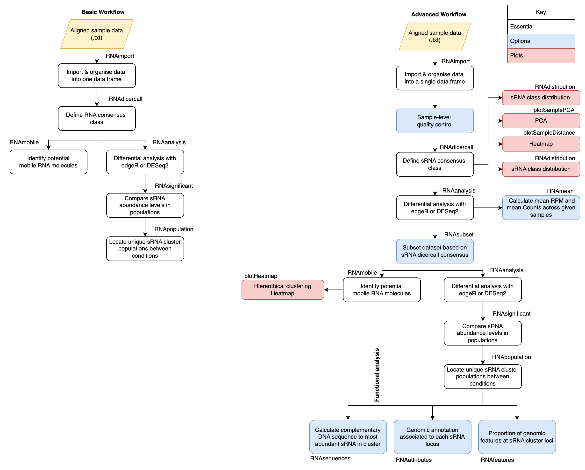

<br>
```{r setup, include = FALSE}
knitr::opts_chunk$set(
  collapse = TRUE,
  fig.align='center',
  external=TRUE,
  echo=TRUE,
  warning=FALSE,
  comment = "#>"
)
```

 
# Introduction
In plants, systemic signalling is an elaborated molecular system which
coordinates plant development, integrating and transmitting the information 
perceived from environment to distant organs.An important role in 
long-distance signalling is played by small RNA molecules (sRNAs). These 
endogenous sRNAs can be produced in a tissue and then transported
systemically across the vascular system into recipient organs, where they can
induce a molecular response and coordinate physiological changes. Plant grafting
can be utilse to create chimeric plant systems composed of two genotype. For 
example, grafting can join tomato and eggplant or different species of 
grapevine. Grafting of horticultural crops can lead to favorable traits, such 
as improved plant vigour or architecture, and resistance to stress. sRNAs have
been known to move across a graft junction, hence, understanding the complex
regulatory networks controlled by sRNAs traveling from different genomes could
assist the development of novel methods for transferring traits into crops, as
alternatives to traditional breeding or transgenic approaches.

Currently, for each study it has been necessary to adapt general RNA 
sequencing pipelines to the specific study of mobile molecules. Several genomic 
studies used grafting to explore and characterise mobile sRNAs in chimeric 
systems, however, it is clear that there is not a  standardised approach.

Here we introduce the R Package \code[mobileRNA], to aid the identification of 
mobile RNA molecules and  explore population-scale changes in chimeric systems 
in comparison to its non-chimeric control. The tool offers a workflow for 
pre-processing and analysis. Ultimately, the pipeline offers an optimised 
mapping/alignment of samples to genome assemblies to improve sRNA origin, and 
offers analysis steps to remove mapping errors, visualization of the 
results, and supports output for functional analysis. 
<br>

# Methods
This manual offers a pipeline for the analysis of sRNAseq data taken from 
chimeric systems. For example, plant grafting experiments between different 
cultivars and species (with distinct genome assemblies). This pipeline involves
pre-processing and analysis steps for the identification of candidate mobile 
sRNA molecules and the exploration of population level changes in chimeric 
systems. 

There are two clear area which must be optimised to make better predicts of the  
sRNA mobility and population dynamics in chimeric systems:
* Optimisation of the alignment steps 
* Optimisation of analysis: sRNA classification and mapping error removal.  


The first involves optimising the use of mapping algorithm to best place sRNA to 
each genome. Here, we supply the mapping algorithms with as much information as 
possible to make its predictions. This includes supplying both genome assemblies 
at the same time, through the use of a merged genome. A merged genome is a 
single FASTA file containing multiple genome assemblies. In many databases, the 
chromosome names have been consistently named in the same patterns. 
This means that when you merge multiple genome assemblies together it is very 
challenging to distinguish the individual genomes in the merged file. here, 
we offer a function to merge two genome assemblies into a single file and is 
able to maintain the distinguishability by adding a distinct pre-fix to 
chromosome names in each genome. The other bit of extra information to supply to 
the aligner, is a list of loci where sRNA clusters have been identified in each 
sample in the analysis. This ensure consistency across the analysis and helps 
prevent false assumptions. The first thing to understand is that sRNA molecules 
are expected to have a very low abundance. It might be the case that in one 
replicate the abundance of reads at a given sRNA locus was not significant 
enough to record as a sRNA cluster, while in another replicate it was recorded. 
Therefore, it would be wrong to assume there are zero reads at the 
loci. Collectively, considering the extra information should optimise the 
alignment of sRNAs to the bets locations within the merged genome.  

The second area to optimise is the analysis in R. The analysis workflow can be
completed in a simple 3-step process to identify potentially mobile sRNAs and 
similarly to explore the population-scale dynamics this can be achieved in a
simple 4-step process. Across the analysis, additional features are available to 
advance the analysis. This includes plotting principal component 
analysis results, heatmaps and distribution plots, as well as including 
statistical analysis through the deployment of differential analysis method 
(edgeR or DESeq2), and steps to assist functional analysis. At many of 
the core steps, there is the ability to remove mapping errors by comparing 
controls to the treatment. This is a step not obviously described by other 
workflows but adds huge value to the analysis. Similarly, an important core step 
to understand is consensus dicer classification (see function 
\code[mobileRNA::RNAdicercall()]). For a given sRNA cluster, each replicate at 
the mapping and clustering pre-processing step will have predicted the class
(default: 20-24nt). The consensus dicer classification step uses this 
information to define the classification of the cluster. There is a range of 
parameters to control how these are drawn, making it either stringent or loose, 
which will alter the downstream analysis. Finally, the step to identify
the candidate mobile molecules (see function \code[mobileRNA::RNAmobile()]) also 
has a parameter which can either result in stringent or looser outcomes. This
parameter utilses the number of replicates which contributed to the consensus 
dicer classification as a threshold value. For instance, it would be more 
stringent to select sRNA clusters which were unambiguously classified across 
condition replicates. 

Here we introduce the use of statistical analysis to identify mobile sRNA 
molecules in chimeric systems, and it should be emphasized that this is an 
optional step. However, statistical analysis for the exploration of population
dynamics should be a mandatory step. Here we include a single 
function which can be instructed to undertake differential analysis using either 
the edgeR or DESeq2 method (see function \code[mobileRNA::RNAanalysis()]). The
function outputs additional columns to your working dataset, including the 
raw count mean, log2FoldChange, p-value and adjusted p-value. 

## Workflow Summary
The summarised workflow is shown below, where it begins in R-Studio to merge 
the two genome assemblies into one, then the pre-processing moves into Linux to 
align each replicate to the merged reference and then back into R-Studio to 
undertake the analysis to identify potentially mobile RNA species.  

```{r, out.width="400", out.height="350", fig.align="centre",  echo=FALSE}
knitr::include_graphics("../man/figures/program_flow.png")

```
<br>


The analysis pipeline, splits into two tracks when trying to identify candidate
mobile sRNAs and population dynamics. This can be seen in the diagram below:


```{r, fig.align="centre",  echo=FALSE}


```
<br>


# Installation

The latest version of `mobileRNA` can be installed via GitHub
using the `devtools` package:

```{r,  eval=FALSE, message=FALSE}
if (!require("devtools")) install.packages("devtools")
devtools::install_github("KJeynesCupper/mobileRNA", ref = "main")
```

Load package to library:
```{r,  message=FALSE}
library(mobileRNA)
```


## An overview of the data used

For the following examples, a semi-synthetic small RNA-seq data set has been 
utilised to simulate the movement of sRNA molecules from an Tomato 
(*Solanium lycopersicum*) rootstock to a Eggplant (*Solanium melongena*) 
scion, a grafting system known to be compatible. 

* The three heterograft replicates: known as:`heterograft_1`, `heterograft_2` & `heterograft_3` are individual tomato replicates spiked with 150 tomato sRNA clusters. 

* The self-graft replicates: known as `selfgraft_1`, `selfgraft_2` & `selfgraft_3`, are the individual tomato replicates without the spiked tomato sRNA clusters. 


The replicates mirror each other where, for instance, `heterograft_1` 
and `selfgraft_1` are the same replicate, either with or without the spiked 
clusters. These replicates serve for the aim to analyse sRNA mobility. 

The data set, called `sRNA_data`, stores a matrix containing the
pre-processed data from the experiment. As a
user, this allows you to see what a full data set might look like and how
you might expect it to change across the analysis. Please not that the data 
has been doctored to reduce the size of the file. 

These can be loaded in these R workspace by using the following command:


```{r Load, message=FALSE}
data("sRNA_data")
```

In addition, there are two further datasets called "sRNA_data_consensus" and 
"sRNA_data_mobile" which are utilised in the function documentations. Both 
build on the "sRNA_data" dataset where "sRNA_data_consensus" contains the 
RNA consensus results formed by the function [RNAdicercall()]. While, the 
"sRNA_data_mobile" contains only the likely mobile sRNAs selected by the 
function [RNAmobile()] under the default parameters. 
<br>

## Data organisation
There are two key elements required for the pipeline analysis:
* sRNA-seq sample replicates  (.fastq/.fq)
* Two reference genomes (.fasta/.fa)

And one additional element; to improve functional analysis:
* Reference genome annotations (.gff/.gff3)
<br>
<br>

### Naming data files

It is recommended to rename your files to names you wish for them to
be represented as within the analysis and shown as labels in plots.
Plus, it makes the analysis easier!

For example, instead of names such as:

- 1: `sample_1.fq`
- 2: `sample_2.fq`
- 3: `sample_3.fq`
- 4: `sample_4.fq`
- 5: `sample_5.fq`
- 6: `sample_6.fq`

For the example data set included in the package, here we have renamed the
files based on the condition (treatment or control).For the hetero-grafts, where 
the is a eggplant scion and an tomato rootstock:

- 1: `heterograft_1.fq`
- 2: `heterograft_2.fq`
- 3: `heterograft_3.fq`

and for the eggplant self-grafts:

- 4: `selfgraft_1.fq`
- 5: `selfgraft_2.fq`
- 6: `selfgraft_3.fq`
<br>


### The reference genomes and annotation files (.fasta/.fa)
The pipeline is designed to analyse grafting systems with two
distinct genomes, here tomato and eggplant.
<br>


# Pre-Processing
The pre-processing step involves cleaning raw data and aligning data to the
merged genome.  Going forward, the pipeline has assumed that the sRNA-seq 
samples have met quality control standards.

We recommend installing and using the `ShortStack` 
(https://github.com/MikeAxtell/ShortStack) program to aligns samples to the
merged genome and undertake cluster analysis. This program is specifically 
formulated for sRNAseq analysis, utilising Bowtie (Version 1) to map samples and 
a specifically formulated algorithm to cluster sRNAs.

Here, we introduce an alternative mapping method for the analysis of plant
heterograft samples. The heterograft system involves two genotypes; here
the two genome references are merged into a single reference to which
samples are aligned to.

`mobileRNA` offers a function to merge two FASTA reference genomes into one.
To distinguish between the reference genomes in a merged file, it is important
to make sure the chromosome names between the genomes are different and
distinguishable. The function below added a particular character string to the
start of each chromosome name in each reference genome. As standard, the string
`A_` is added to the reference genome supplied to `genomeA` and `B_` is added
to the reference genome supplied to `genomeB.` These can be customized to the
users preference, see manual for more information.
<br>

## Pre-mapping

### Merging Genome Assemblies
Here we merge the two reference genomes into a single merged genome using the
[mobileRNA::RNAgenomeMerge()] function. As default, this function changes the
chromosome names of each genome to ensure they are distinguishable. To do so,
the function requires an input of the initials of each organism's Latin name.
But why do this:

* If the two genomes use the same pattern to name the chromosomes, the user will not be able to differentiate the chromosomes from one another in the merged genome. This could be solves by adding letters to the chromosomes of one of the genomes, for example, `SM` to represent the Latin name of eggplant.

* If a chromosome naming pattern contains punctuation, the mapping step will not work.


In the example, the *Solanum lycopersicum* (version 4) genome contains a
full-stop/period within each chromosome name which needs to be removed as well.
Here we rename the chromosomes of the tomato genome to `SL` and the chromosomes
related to the eggplant genome (*Solanum melongena*) to `SM`.

```{r, eval = FALSE}
RNAmergeGenomes(genomeA ="/Users/user1/projectname/workplace/reference/ref1.fa",
               genomeB ="/Users/user1/projectname/workplace/reference/ref2.fa",
               abbreviationGenomeA = "SL",
               abbreviationGenomeB = "SM",
               out_dir = "/Users/user1/projectname/workplace/reference/merge/
               ref_merged.fa")
```


## Merging Genome Annotations
To identify associates between sRNA clusters and genomic features, the genomic
annotation files (GFF) of each reference genome must be merged in the same way
the reference genomes were. This includes following the same naming patterns for
the chromosomes in each genome as undertaken earlier with the `RNAmergeGenomes()`
function. To undertake a similar merging between the two GFF files, use the
`RNAmergeAnnotations` function.

```{r, eval = FALSE}
## merge the annotation files into a single annotation file
RNAmergeAnnotation(annotationA = "/Users/user1/projectname/workplace/
                   annotation/annotation_1.gff3",
                   annotationB = "/Users/user1/projectname/workplace/
                   annotation/annotation_1.gff3",
                   abbreviationAnnoA = "SL",
                   abbreviationAnnoB = "SM"
                  out_dir = "/Users/user1/projectname/workplace/
                  annotation/merge/anno_merged.gff")

```


## Auto-Detection of sRNA Cluster
Here we identify and build a list sRNA clusters within each sample to assist
the mapping step later on to ensure consistency across the analysis. This step
is very important to consider in the analysis as it prevents false assumptions. 
This step aligns a replicate to the given genome assembly and the
outputs contains loci where sRNA clusters were found. Across your replicates,
there will be difference in the cluster identified. In some instance, it might 
be the case that the abundance of reads at a given sRNA locus was not 
significant enough to record as a sRNA cluster, while in another replicate it 
was recorded. Therefore, it would be wrong to assume there are zero reads at the 
loci. Here, we identify all the potential sRNA cluster loci and use this 
information to improve the mapping. 


We recommend installing the `ShortStack` 
(https://github.com/MikeAxtell/ShortStack) program to detect sRNA clusters and 
align sRNAseq samples. 
<br>

#### Step 1 - Cluster analysis with ShortStack

``` bash
ShortStack \
--readfile <control_1.fastq> \
--genomefile <merged_reference.fa> \
--bowtie_cores 6 \
--mmap n \
--mismatches 0 \
--nohp \
--outdir <./output/directory>

```


#### Step 2 - Build sRNA cluster list 

Now, we collate all the sRNA loci information from each sample into a text file. 

``` r
# location of step 1 output
folder <- <./output/directory/from/step/1/>

# name and location to save output file to (must be .txt)
save_folder <- <./output/directory/ClustersInfo.txt>

# names of samples (ie. folder names)
sample_names <- c("<treatment_1>", "<treatment_2>", "<control_1>","<control_2>")


loci_info <- RNAloci(files = folder, 
             out = save_folder,
             samples = sample_names)
```


## Mapping   

Each sample is mapped to the merged reference genome with the list of sRNA 
clusters. 


``` bash
ShortStack \
--readfile <control_1.fastq> \
--genomefile <merged_reference.fa> \
--locifile <./output/directory/ClustersInfo.gff3> \
--bowtie_cores 6 \
--mmap n \
--mismatches 0 \
--nohp \
--mincov 5 \
--outdir <./output/directory/step2/>

```

<br>

# Analysis
Here, the analysis of the pre-processed data occurs, with the aim to
identify if any mobile sRNA molecules are traveling from one genotype to
the other in your grafting system.
<br>

## Import Data
In the pre-processing steps, the data was cleaned and aligned to
the merged reference genome. During the mapping step, a folder for each sample
is created which stores all the results in. The analysis steps requires the
information which is stored in the `Results.txt`.

The `RNAimport()` function imports the data from the folder containing
all sample folders. The function extracts the required information, stores it
in a matrix.

The function requires some information to coordinate the importation and
calculations. It requires a directory path to your processed samples;
this is the path to the folder containing all the
individual sample folders which is stores in argument `directory`. The second
directory path is to the loci file containing information on the loci of the
sRNA clusters across the analysis, stored in the argument `loci`.
The last pieces of information the function requires a vector containing the
sample names, both treatment and control replicates which is stored in the argument
`samples`. The sample names must match the names of the folders produced in
the mapping, and stored in the directory supplied to the argument `directory`.


```{r, eval = FALSE, message=FALSE}
## Import & organise data.
results_dir <-  "./analysis/alignment_unique_two/"
sample_names <- c("heterograft_1","heterograft_2", "heterograft_3",
                  "selfgraft_1", "selfgraft_2", "selfgraft_3")


sRNA_data <- RNAimport(input = "sRNA",
                       directory = results_dir,
                           samples = sample_names)

```

```{r}

# example dataframe 
head(sRNA_data)
```

<br>

## Sample-level quality control
A handy step in the analysis is to assess the overall similarity between
sample replicates to understand which samples are the most similar and which are
different, and where the most variation is introduced in the data set.
As well as understanding whether the data set meets your expectations.
It is expected that between the conditions, the sample replicates show
enough variation to suggest that the replicates are from different groups.

To investigate the sample similarity/difference, we will undertake sample-level
quality control using three different methods:

- Distribution of RNA classes within each sample
- Principle component analysis (PCA)
- hierarchical clustering Heatmap

This will show us how well samples within each condition cluster together, which
may highlight outliers. Plus, to show whether our experimental conditions
represent the main source of variation in the data set.

Here we will be employing an unsupervised clustering methods for the PCA and
hierarchical clustering Heatmap. This involves an unbiased log2-transformation of
the counts which will emphasis the the sample clustering to improve
visualization. The DESeq2 package contains a particularly useful function to
undertake regularized log transformation (rlog) which controls the variance
across the mean, and in this package we have utilized this for the quality
control steps.

<br>

### Plot the distribution of RNA classes within each sample
Explore the number of each RNA class identified within each sample using the
`RNAdistribution` function which produces a table and plots the results. The
results can be plotted as either a bar chart (`style = "bar"`)  or a line graph
(`style = "line"`) for each sample and can be shown in a bar chart facet
(`facet = TRUE`) or in as a single line graph, where each line represents a
sample (`together=TRUE`). Alternatively, the results can be plotted individually
for each sample in either format.


```{r, echo=FALSE}
cap9 <- "An example line graph (A) and bar graph (B), to show the distribution of
RNA classes within each sample. Figure C shows all replicates plotted on a 
single plot and the accompanying data."

```

```{r, message=FALSE}
# plot each replicate as a line, separately, and facet 
sample_distribution_line <- RNAdistribution(sRNA_data,
                                            style = "line",
                                            together = FALSE,facet = TRUE)

                                            
 # plot each replicate as a bar, separately, and facet 
sample_distribution_bar <- RNAdistribution(sRNA_data,
                                           style = "bar",
                                           facet = TRUE)

# plot each replicate on a single plot
sample_distribution <- RNAdistribution(sRNA_data,
                                           style = "line",
                                           together = TRUE)
```

Lets view these plots:

```{r, message=FALSE, fig.cap=cap9, fig.show="hold", out.width="33%", fig.subcap= c("A","B", "C", "D")}

# View plot (only)
sample_distribution_line$plot


# View plot (only)
sample_distribution_bar$plot

# View plot
sample_distribution$plot
# View data 
sample_distribution$data
```
<br>


### Principle component analysis to assess sample distance
Principal Component Analysis (PCA) is a useful technique to illustrate sample
distance as it emphasizes the variation through the reduction of dimensions in
the data set. Here, we introduce the function `plotSamplePCA()`

```{r, echo=FALSE}
cap3 <-"An example of a PCA, illustracting the sRNA data set sample similarity"

```

```{r ,message=FALSE, fig.cap=cap3, fig.show="hold"}

group <- c("Heterograft", "Heterograft", "Heterograft",
            "Selfgraft", "Selfgraft", "Selfgraft")

plotSamplePCA(sRNA_data, group)

```

This PCA is somewhat not what we would expect to see in a real dataset. This is
because PC1 is showing the variation between the non-spiked and spiked version 
of the replicate while PC2 shows the natural variation between the replicates. 
In a real dataset, we would expect there to be little difference between the 
treatment and control. There should be much more natural variation between the 
replicates, but it is unlikely that there will be a huge distinctive variation
between the samples across the conditions. This is because it is likely that 
only a very small number of endogenous mobile sRNAs are present in the 
heterograft system compared to the self-graft controls while the population 
of sRNAs present in the destination tissue is expected to be largely similar. 
Although, there is likely to be some difference in this too due to the 
endogenous changes. 
<br>

### Hierarchical clustered heatmap to assess sample distance

Similarly, to a PCA plot, the `plotSampleDistance()` function undertakes
hierarchical clustering with an unbiased log transformation to calculate sample
distance and is plotted in the form of a heatmap.

```{r, echo=FALSE}
cap4 <-"An example of a heatmap,illustracting the sRNA data set sample similarity"

```
```{r ,message=FALSE, fig.cap=cap4, fig.show="hold"}
plotSampleDistance(sRNA_data)

```
<br>


## Define the consensus RNA class
Have a look at the `sRNA_data` object, you will see that for each sample the
class of sRNA has been determined (see columns with names starting with
DicerCall). The result will either state a number from 20-24 which represents
the nucleotide length of the sRNA, or, state NA/N which represents that the
sRNA was unclassified in the sample. There is usually some discrepancies between
the classification of a sRNA, therefore, a consensus class can be
assigned based off the information from the treatment samples.
The `RNAdicercall()` function is used to compute this by counting the number
of occurrences of classifications for a sRNA. The consensus is determined
based on the class with the most counts.

When working with samples from a chimeric system, the function contains a 
specialised parameter which should be utilized. This is `chimeric=TRUE`, along
with the `id` and `controls` parameters. This helps optimise classification 
by removal of mapping errors. 

Moreover, the user would prefer to form the dicer consensus based on 
the results of specific samples this can be specified to the `conditions` 
parameter. The function also works to remove noise from your data, which as 
default is not undertaken. If the user wishes to remove the noise, set 
`tidy=TRUE` to promote the removal of unclassified clusters.

For the downstream analysis, it can be useful to define the distinct 24-nt and
21/22-nt populations of sRNA molecules at the beginning of the analysis.
Hence, the data should be subset. To subset the data, use the `RNAsubset()`
function to choose which sRNA populations to include: 20-nt, 21-nt, 22-nt, 
23-nt, or 24-nt. It is recommended to subset the data into two dataframes: 
one which includes only 24-nt sRNA and the other to include both
21-nt and 22-nt sRNAs. To instruct the `RNAsubset()` function to select
specific groups, use the `type` argument.

```{r, message=FALSE}

# define consensus, store as a data summary file.
sRNA_data_consensus2 <- RNAdicercall(data = sRNA_data, chimeric = TRUE, 
                                     genome.ID = "SL", 
                                     controls = c("selfgraft_1", 
                                                  "selfgraft_2", 
                                                  "selfgraft_3"),
                                     tidy=TRUE)

head(sRNA_data_consensus)

# Subset data for analysis: 24-nt sRNAs
sRNA_24 <- RNAsubset(sRNA_data_consensus, type = 24)
# Subset data for analysis: 24 21/22-nt sRNAs
sRNA_2122 <- RNAsubset(sRNA_data_consensus, type = c(21, 22))

```

<br>

### Plot consensus classification of sRNA

Use `RNAdistriution()` to visualize the distribution of the consensus sRNA
classes within the data. This step can be used as a quality control step to
illustrate the distribution of each sRNA class within the data. The function
can plot the absolute or relative frequency, use argument `relative`. It can be
beneficial to view the absolute frequency as well as the relative to observe
whether the data meets your expectations.

```{r}
consensus_plot <- RNAdistribution(data = sRNA_data_consensus,
                                  consensus = TRUE, 
                                  style = "consensus")
# view 
consensus_plot$plot
consensus_plot$data
```


<br>

## Differential Expression analysis with DESeq2 or edgeR
Differential expression (DE) analysis is undertaken to identify sRNA which are
statistically significant to discover quantitative changes in the expression
levels between the treatment (hetero-grafting) and the control (self-grafting)
groups. This technique can be undertaken with a variety of tools, in `mobileRNA`
users have the option to use the `DESeq2` or `edgeR` analytical method.

Although both methods will produce different results, it is typically they case
that that at the step where we isolate the mobile molecules, the same results
are produce. What is meant by this, is that the same mobile molecules are
typically identified at the end of the analysis regardless of the analytical
method. However, in particular case, one method will be preferred over the other.
For instance, the `DESeq2` method is not appropriate when the experiment does not
contain replicate (ie. one sample replicate per condition). On the other hand,
edgeR can be used. Here, we have included the recommend practice for edgeR when
the data set does not contain replicates. This option can be employed by setting
a custom dispersion value, see argument `dispersionValue`.


Please note that this step is optional and not a required part of the analysis. 
```{r DEprep, message = FALSE, warning = FALSE}
# sample conditions in order within dataframe
groups <- c("Heterograft", "Heterograft", "Heterograft",
            "Selfgraft", "Selfgraft", "Selfgraft")

## Differential analysis of whole dataset: DEseq2 method 
sRNA_DESeq2 <- RNAanalysis(data = sRNA_data_consensus,
                              group = groups,
                              method = "DESeq2" )

## Differential analysis: DEseq2 method
# 24-nt sRNA data-set
sRNA_24_DESeq2 <- RNAanalysis(data = sRNA_24,
                              group = groups,
                              method = "DESeq2" )
# 2122-nt sRNA data-set
sRNA_2122_DESeq2 <- RNAanalysis(data = sRNA_2122,
                                group = groups,
                                method = "DESeq2" )


## Differential analysis of whole dataset: edgeR method 
sRNA_edgeR <- RNAanalysis(data = sRNA_data_consensus,
                              group = groups,
                              method = "edgeR" )


## Differential analysis: edgeR method
sRNA_24_edgeR <- RNAanalysis(data = sRNA_24,
                             group = groups,
                             method = "edgeR" )

sRNA_2122_edgeR <- RNAanalysis(data = sRNA_2122 ,
                               group = groups,
                               method = "edgeR" )

# view example output:
head(sRNA_edgeR)


```

<br>

## Identify the mobile molecules
It is essential to remove the noise from the data to isolate potential mobile
molecules which include falsely mapped clusters and, in this case, the clusters
which map the the scion genotype when the aim is to identify molecules traveling
from the rootstock. In the data, the aim is to explore whether there are tomato
sRNA traveling up through the graft junction and exiting into the
eggplant leaf tissues. We can identify potential mobile molecule by using
the `RNAmobile()` function. It selects clusters mapping to the rootstock
genome in the hetero-graft. Therefore, we will remove clusters mapped to
chromosome in the genotype used in the self-graft controls.


In the example, the tomato genome has chromosome labeled with
"SL40" whilst the the eggplant genome has no labels. To remove clusters
associated with the eggplant genome and keep only clusters associated with the
tomato genome, set the `"task"` argument as `"keep"`.

The `RNAmobile()` function can take into account the statistically significance.
If set to consider this, the function will filter sRNA based on an adjusted
p-value threshold = 0.05. The threshold can be changed to make it less stringent
by using the argument `padj`.Similarly, if you would prefer to extract the mobile 
RNA based on the p-value,rather than the adjusted p-values,  a numeric threshold 
can be set for the argument `p.value`. As default, the function does not consider
the statistical values and properties of the sRNAs. To consider, use 
`statistical=TRUE`


Below we have used the datasets which contains the additional columns with the
statistical values. As stated above, we do not need to use the statistical values 
to identify the mobile molecules but it can be explored and utilised to plot a 
heatmap based on the logFC. 


```{r , message=FALSE}
# vector of control names
control_names <- c("selfgraft_1", "selfgraft_2", "selfgraft_3")


## Identify potential tomato mobile molecules, before subsetting classes
mobile_sRNA <- RNAmobile(data = sRNA_DESeq2, 
                         controls = control_names,
                         genome.ID = "SL40",
                         task = "keep", 
                         statistical = FALSE)

# or identify within specific classes 
# within 24-nt sRNA datset 
mobile_sRNA_24 <- RNAmobile(data = sRNA_24_DESeq2, 
                         controls = control_names,
                         genome.ID = "SL40",
                         task = "keep")
# within 21/22-nt sRNA datset
mobile_sRNA_2122 <- RNAmobile(data = sRNA_2122_DESeq2, 
                         controls = control_names,
                         genome.ID = "SL40",
                         task = "keep")


# If you wish to consider the statistical values from DESeq2 analysis 

mobile_sRNA_sig24 <- RNAmobile(data = sRNA_24_DESeq2, 
                         controls = control_names,
                         genome.ID = "SL40",
                         task = "keep", 
                         statistical = TRUE)

mobile_sRNA_sig2122 <- RNAmobile(data = sRNA_2122_DESeq2, 
                         controls = control_names,
                         genome.ID = "SL40",
                         task = "keep", 
                         statistical = TRUE)


```
<br>


### Heatmap plots to represent mobile molecules
Here we can use a hierarchical clustering heatmap to analysis the potential
statistically significant mobile sRNAs we have identified.
It is expected that the log2 fold changes should be opposite between your
treatment and controls where the treatment samples shows up-regulation and the
control samples show down-regulation.

<br>

### Mobile molecules from the 24-nt sRNA dataset
```{r, echo=FALSE}
cap7 <- "An example heatmap of the potential mobile RNA molecules Identifed by the `DESeq2` method Class of 24-nt sRNAs (left) and Class of 21/22-nt sRNAs (right). Where the rows represents the sRNA cluster number and the columns represents replicates."


```

```{r,fig.cap=cap7, fig.show="hold", out.width="50%", fig.subcap= c("A","B") }
p10 <- plotHeatmap(mobile_sRNA_sig24)
p11 <- plotHeatmap(mobile_sRNA_sig2122)
```

<br>

### Save output 

```{r, eval = FALSE}
write.table(mobile_sRNA, "./output.txt")
```

<br>

## Functional Analysis 
By now you will have retrieved a list of potentially mobile sRNA molecules and 
you will want to identify whether they play a role in the biological system. 

Small interfering RNAs (siRNAs) have a length of 24-nucleotides, and are known
to play a role in the RNA-directed DNA methylation pathway via targeting 
complementary sequencing in the DNA. While, miRNAs have a length of 
21/22-nucleotides, and are known to instigate post-transcriptional gene silencing 
via mRNA degradation or repression of translation.

To predict the function of a mobile sRNA in destination tissues, we can overlap 
the information with the genome annotation of the origin tissue to determine 
the local functionality. As well as, retrieving the nucleotide sequence of 
the most abundant sRNA within a cluster and locating complementary sequences in 
both the genome of origin and genome of destination using BLAST. 

If you have different datatypes, for example RNAseq and BSseq, and want to 
overlap your data it might be interesting to see whether there are complementary
DNA sequences at the promoter regions of your deferentially expressed genes of 
interest to the identified potential mobile sRNAs. Moreover, in theory, if these 
regions also show differential methylation it could be a potential indication of 
a molecular pathway. 


IMPORTANT: If chromosome names were altered in either of genome assemblies used
in the mapping steps, the chromosome names in the genome annotation files must 
match the same pattern. If you used the [mobileRNA::RNAmergeGenomes()] 
function, the chromosome names will by default be altered. The 
[mobileRNA::RNAmergeAnnotations()] function can be utilsed to alter both 
genome annotation files in the same way. This functions alters the names, saves
each altered genome annotation and then merges them into one. 

<br>

### Add genomic attributes to sRNA clusters   
Each sRNA cluster contains coordinates, these can be matches with coordinates in
an annotation file. If there is a match, the function returns the input data 
with additional fields, where sRNA cluster will receive information on:

- `source` : name of the program that generated this feature, or the data source
(database or project name)
- `feature` : feature type name, e.g. Gene, Variation, Similarity
- `score` : A floating point value
- `strand` : defined as + (forward) or - (reverse)
- `frame` : One of '0', '1' or '2'. '0' indicates that the first base of the
feature is the first base of a codon, '1' that the second base is the first
base of a codon, and so on
- `attribute` : A semicolon-separated list of tag-value pairs, providing
additional information about each feature.


Using the genomic locations of the mobile sRNA clusters, we can identify 
overlaps in the genome annotation of the origin tissue to predict the 
implication of the mobile sRNA. 

This function can be utilsed at the beginning of the analysis steps where all 
sRNA clusters from both genotypes can be annotated with the genomic attributes 
associated to their location. This can be completed in a single step using 
a merge annotation file using the function [mobileRNA::RNAmergeAnnotations()]. 


```{r, eval = FALSE}

mobile_df_attributes <- RNAattributes(data = mobile_sRNA,
                            annotation = "./annotation/origin_annotation.gff3")
```
<br>

### Summarise overlaps with genomic features 
We can also locate specific genomic features which overlap with the the sRNA 
cluster locus including promoter regions, exon, introns, untranslated regions 
and repeat regions.The results can either be displayed in the matrix as an
absolute value or as a percentage of the total:

NOTE: This function look for the exact matches in the locus (chromosome, 
start and end regions) between the sRNA cluster and the annotation file.  
 


```{r, eval = FALSE}

mobile_df_features <- RNAfeatures(data = mobile_sRNA,
                            annotation = "./annotation/origin_annotation.gff3", 
                      repeats = "./annotation/origin_annotation_repeats.gff3")
```


The distribution of sRNA clusters across genomic features is strongly 
related to the class of sRNA based on their nucleotide length. It is expected 
that 24-nt sRNA are associated with repeat regions and promoter regions, 
while 21/22-nt sRNA are likely to be associated with coding sequence.


The resulting dataframe can be passed into a plot of your choice. Similarly,
this features can be utilsed across different data sets. For example, across
the total data set or specific mobile sRNA subsets.
<br>

### Retrieve sRNA sequence & complementary sequences   
Lastly, lets extract the sRNA cluster sequences.These can utilised with `BLAST`, 
or plant sRNA target prediction tools such as `TargetFinder` 
(https://github.com/carringtonlab/TargetFinder) or overlapped with `mRNAseq` 
data to identify complementary sequences to further elucidate the potential 
function of sRNAs. 


The `RNAsequences` function identifies whether the most abundant sRNA is 
consistent across the replicates, and if so, it extracts the sRNA nucleotide
sequence and calculates the RNA and DNA complementary sequences, as well as 
stating the length of the sequence. 


```{r}

mobile_sequences <- RNAsequences(mobile_sRNA)

head(mobile_sequences)
```
<br>


## Explore population-scale sRNA difference 
Here, we will look at comparing the native population of sRNAs and how they 
might have changes in the leaf due to the chimeric system compared to the 
control. 

As a reminder, the data used here will not yield any results as the 
treatment and control samples contain the exact same population of eggplant 
sRNAs, the only difference in the treatment samples are the spiked tomato 
sRNA clusters. 


We have already undertaken the statistical analysis in the previous steps, we
will be utilising this dataset going forward.

### sRNA abundance 
When comparing treatment to control conditions, it might be the case that 
the same sRNA clusters are found within both yet there could be difference in 
the total abundance of the shared clusters. For instance, for a given sRNA 
cluster the samples in the treatment condition might have a greater abundance 
than the samples in the control condition. These difference could attribute to 
observed differences. 

The statistical analysis calculated the log2FC values for each sRNA cluster by 
comparing the normalised counts between treatment and control. Here, 
a positive log2FC indicates an increased abundance of transcripts for a given 
sRNA cluster in the treatment compared to the control, while negative log2FC 
indicates decreased abundance of transcripts for a given sRNA cluster. The 
statistical significance of the log2FC is determined by the (adjusted) pvalue
also calculated in the previous step. 

Here we will filter the data to select sRNA clusters which are statistically 
significant, and then plot the results as a heatmap to compare the conditions. 
```{r}
# select only significant sRNAs
significant_sRNAs <- RNAsignificant(sRNA_edgeR)


#plot
p1 <- plotHeatmap(significant_sRNAs, cluster = FALSE, row.names = FALSE)

```

Lets look at the plot:

```{r}
p1$plot 
```
<br>

## Step 6: Identify absolute sRNA population difference 
Finally, the  `RNApopulation()` function can be utilised to identify unique 
sRNA populations found in the treatment or control condition.


First lets look at the sRNA clusters unique to the treatment condition.
In the chimeric heterografts, we expect that the foreign sRNAs will also be 
selected in this pick-up, therefore, we can use the parameter `genome.ID` to 
remove sRNA cluster related to the foreign genome. 
```{r, eval=FALSE}
# select sRNA clusters only found in treatment & not in the control samples
treatment_reps <- c("heterograft_1", "heterograft_2" , "heterograft_3")
unique_treatment <- RNApopulation(data = sRNA_data_consensus, 
                                   conditions = treatment_reps)

# look at number of sRNA cluster only found in treatment 
nrow(unique_treatment)
```


Now, the sRNA clusters unique to the control condition:
```{r, eval=FALSE}
# select sRNA clusters only found in control & not in the treatment samples
control_reps <- c("selfgraft_1", "selfgraft_2" , "selfgraft_3")
unique_control <- RNApopulation(data = sRNA_data_consensus, 
                                   conditions = control_reps)
# look at number of sRNA cluster only found in control  
nrow(unique_control) 
```
<br>

The plotting functions within the package can be used to display these results, 
specifically \code[RNAdistribution()] and \code[plotHeatmap()]. Similarly, the
functions to assist with functional analysis can also be utilsied to pull 
the consensus sRNA sequence for each cluster in the population, or find 
overlaps with known annotations in the native genome.
<br>


# Additional features

The *mobileRNA* package offers several optional extra-helpful functions to aid
analysis. This includes a function to calculate the mean RPM and counts across
specific samples and also calculate the overlap between genomic features and
sRNA clusters.

<br>

## Calculate RPM and Count means for specific samples
This function calculates the RPM mean and Count mean across specific samples.The 
output of the calculation is added as an additional column to the input dataframe. 

This can be manipulated to be used before or after identified mobile RNAs. When 
calculating means after identifying mobile molecules, it is recommend to base this
on the heterograft samples rather than the full dataset (selfgrafts + heterograft
replicates) as all potential mobile sRNAs should have zero counts or RPM value in 
the selfgraft control replicates. By including the full dataset in these 
calculations, the mean values for the mobile molecules will be skewed. 

Therefore, depending on your intended output this function could be approached 
in multiple ways. 

```{r}
# calculate mean RPM and mean Counts for heterograft samples
selected_samples <- c("heterograft_1", "heterograft_2", "heterograft_3")
means <- RNAmean(data = sRNA_data_consensus, conditions = selected_samples)

```
 <br>

# Session information
```{r}
sessionInfo()
```
