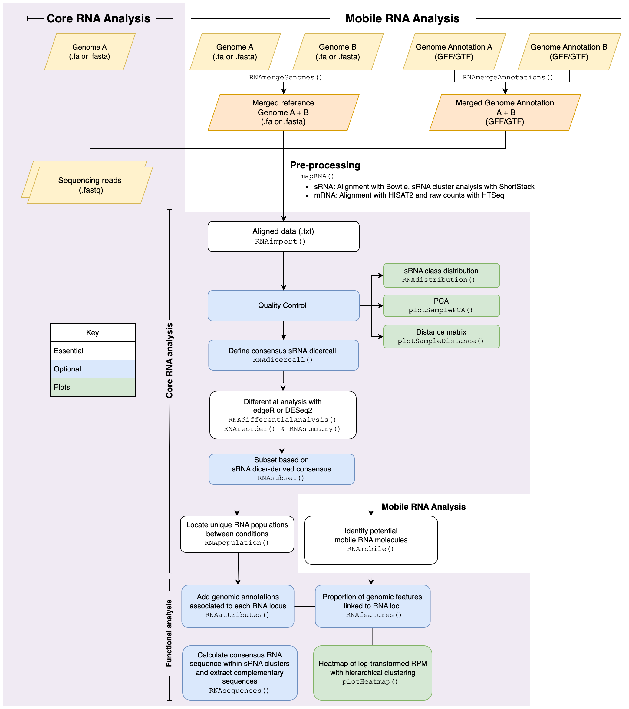

```{r setup, include = FALSE}
knitr::opts_chunk$set(
  collapse = TRUE,
  fig.align='center',
  external=TRUE,
  echo=TRUE,
  warning=FALSE,
  comment = "#>"
)

```

# Introduction

In plants, systemic signalling is an elaborated molecular system which 
coordinates plant development, integrating and transmitting the information 
perceived from the environment to distant organs. An important role in 
long-distance signalling is played by small RNA molecules (sRNAs). The 
nucleotide length of a sRNA helps researchers identify the class of sRNA and 
predict its functionality. Micro-RNAs (miRNAs) are involved in directing 
translational repression and/or the cleavage of messenger RNAs (mRNAs). Whereas 
small interfering RNAs (siRNAs) are involved in the maintenance and de novo DNA 
methylation and account for the majority of sRNAs in plants. These endogenous 
sRNAs can be produced in a tissue and then transported systemically across the 
vascular system into recipient organs, where they can induce a molecular 
response and coordinate physiological changes. Similarly, messenger RNAs (mRNAs) 
can move across distances, and it’s thought they may translate into proteins 
which act as transcription factors in the recipient tissues.

Plant grafting can be utilised to create chimeric plant systems composed of two 
genotypes, such as different species like tomato and eggplant, or plant 
varieties or accessions. Grafting has been used as a method to study RNA 
mobilomes and their impact on the phenotype. Yet, it is clear that there is no 
standardised genomic approach for the analysis of sequencing data to identify an 
RNA mobilome. Here we introduce the R package, mobileRNA, a recommended pipeline 
and analysis workflow for the identification of a sRNAs/mRNA mobilome. In 
addition, the flexibility supports standard RNA analysis between treatment and 
control conditions. For example, to identify sRNA population changes due to the 
application of a treatment such as cold/heat stress or exposure to a pest. 
`mobileRNA` ultimately assists in pre-processing and analysis including the 
characterization of different populations, visualization of the results, and 
supporting output for functional analysis.

As stated, this was developed for applications for plant grafting experimental 
analysis, however, we believe it could have further applications including the 
analysis of dual-host systems.

<br>

# Approach

In grafted plants, when different genotypes are used as rootstock and scions, 
the sequence variation between the two genomes involved can be used to 
discriminate the origin of a sequenced RNA molecule. Therefore, if an RNA 
molecule sequenced from one of the grafted partners (scion or rootstock) has 
been found to match the genome of the other grafting partner, this could 
empirically demonstrate its movement across the graft junction.

Most available genomics approaches to implement this analysis are based on RNA 
sequencing, followed by alignment on a genotype of reference and post-alignment 
screening of genetic variants to identify molecules which have a better match 
for the genotype of the grafted partner. These methods have many limitations, 
which might include:

*	High dependency on arbitrary thresholds to determined mapped and unmapped RNAseq reads.
*	Use of additional statistical tests to discriminate genetic variations from sequencing noise in the post-alignment analysis.
*	High false positive rates. 

Here, to circumvent such problems we propose a method inspired by the RNAseq 
analysis of plant hybrids (Lopez-Gomollon 2022), including an alignment step 
performed simultaneously on both genomes involved. The rationale of this 
approach considers that alignment tools already implement an algorithm ideal 
for the identification of the best matches (according to set parameters) in a 
given genome reference, but they do not account for potential matches to DNA 
sequences which are not provided as reference. Therefore, the two genomes from 
all partners involved in the system are merged in a single FASTA file and used 
as a reference for the unique alignment. Ultimately, in a bid to supply the 
algorithm with as much information as possible to make the best possible 
predictions and placement of sequencing reads to each genome.

The summarised workflow is shown below (Figure 1) where it contains a core 
RNA analysis and a mobile sRNA/mRNA analysis. The core 
analysis represents the standard workflow for the identification of RNA 
populations which have been gained, lost or changed in abundance, for example, 
the sRNA population difference between treatment and condition samples, or 
similarly in a chimeric system, such as plant grafting, we might want to explore 
the native sRNA population from the sample tissue origin (i.e. leaf) which have 
been lost or gained or changes in sRNA abundance. While the mobile analysis 
represents the workflow for the identification of putative mobile sRNAs or mRNA 
in a plant graft system.

As input, the pipeline requires cleaned sRNA or mRNA sequencing reads in FASTQ 
format, along with the genome assemblies which represent the genotypes in the 
system. The diagram below illustrates the complete workflow using `mobileRNA`, 
including essential, optional, and plotting functions. 

<br><br>
```{r, echo=FALSE}
cap01<-"Comprehensive diagram of complete mobileRNA workflows. "
```
```{r, fig.align="centre", echo=FALSE, fig.cap=cap01 }

```
<br>


The analysis approach includes several underlying features to be aware of which 
can alter the final output. When working with a chimeric system, the core steps 
offer the ability to remove mapping errors by comparing control samples to 
treatment samples. If the genotypes in the chimeric system are fairly distantly 
related, it is unexpected that unique reads aligned to the mobile genotype will 
be found in the control samples. With that in mind, we can assume RNAs with 
reads mapped to the mobile genotype from the control samples could be artifacts 
or mapping errors. Hence, these RNAs are removed from the analysis when the 
parameters are utilized. Note that, if the chimeric system is expected to share 
some or a high level of similarity it might be insightful to the analysis to not 
remove these sRNA clusters.

At the end of the analysis, the user will have generated a dataframe where rows 
represent either sRNA clusters or mRNAs and the columns include information on 
the sRNA clusters or mRNAs, individual sample replicates, and more:


#### sRNA Analysis

##### Information on the sRNA cluster:

- `Locus`: Genomic location
- `chr`: Chromosome or scaffold name
- `start` : Start position of the cluster
- `end` : End position of the cluster
- `Cluster`: Cluster Name 
- `DicerConsensus` : Consensus dicercall (Calculated by `RNAdicercall()`)
- `DicerCounts` : Number of replicates which contributed to the consensus dicercall (Calculated by `RNAdicercall()`)
- `CountMean` :  Count mean (Calculated by `RNAdifferentialAnalysis()`)
- `log2FoldChange` : Log fold change (Calculated by `RNAdifferentialAnalysis()`)
- `pvalue` : p-value (Calculated by `RNAdifferentialAnalysis()`)
- `padjusted` : Adjusted p-value (Calculated by `RNAdifferentialAnalysis()`)
- `logCPM` : Log counts per million (CPM/RPM) (Calculated by `RNAdifferentialAnalysis()`)

##### Information on each sample replicate:

- `DicerCall_` : The nucleotide length of most abundant sRNA 
- `Count_` : Number of aligned sRNA reads. As default, these are uniquely aligned (*e.g.* not multi-mapping).
- `RPM_` : Reads per Million 
- `FPKM_` : Fragments Per Kilobase of transcript per Million 
- `MajorRNA_` : RNA sequence of most abundant sRNA in the cluster

#### For mRNA Analysis

##### Information on the mRNA:
- `Feature`: mRNA name
- `SampleCounts` : Consensus dicercall (Calculated by `RNAdicercall()`)
- `CountMean` :  Count mean (Calculated by `RNAdifferentialAnalysis()`)
- `log2FoldChange` : Log fold change (Calculated by `RNAdifferentialAnalysis()`)
- `pvalue` : p-value (Calculated by `RNAdifferentialAnalysis()`)
- `padjusted` : Adjusted p-value (Calculated by `RNAdifferentialAnalysis()`)
- `logCPM` : Log counts per million (CPM/RPM) (Calculated by `RNAdifferentialAnalysis()`)

##### Information on each sample replicate:

- `Count_` : Number of aligned mRNA reads. As default, these are uniquely aligned (*e.g.* not multi-mapping).
- `FPKM_` : Fragments Per Kilobase of transcript per Million 

In addition, the user can utilise additional functions to plot a PCA, 
distance matrix, sRNA class distribution and heatmaps. Plus, **mobileRNA** 
offers functions to assist functional analysis to support the determination 
of the biological implications. For instance, within sRNA analysis, the user can 
extract the consensus RNA sequence for each sRNA cluster for target prediction 
analysis, as well as identifying genomic features associates with each sRNA 
clusters, such as genes or repeat regions. This can be utilised, for example, 
to explore the RNA expression of sRNA-producing genes in parallel analysis.


# Installation

The latest version of `mobileRNA` can be installed via Bioconductor:

```{r,  eval=FALSE, message=FALSE}
if (!require("BiocManager", quietly = TRUE))
    install.packages("BiocManager")

BiocManager::install("mobileRNA")
```

It is also available on GitHub:
```{r,  eval=FALSE, message=FALSE}
if (!require("devtools")) install.packages("devtools")
devtools::install_github("KJeynesCupper/mobileRNA", ref = "main")
```

Load into R library:
```{r, message=FALSE}
library("mobileRNA")
```


## Installing OS Dependencies 

`mobileRNA` works on systems with `R`, and depending on the type of sequencing
data different OS dependencies installed via Conda [@Anaconda] are required for 
the alignment step. 

For sRNA data, `ShortStack` (>= 4.0) [@Axtell2013] and the dependencies are
required. Please consider that `ShortStack` is not available for Windows, hence, 
Windows users will either need to opt to use a virtual machine or 
[Windows Subsystem for Linux](https://docs.microsoft.com/en-us/windows/wsl/install-win10)
In either case, both `R` and `ShortStack` will need to be installed and used on 
the Linux side. Please head to [ShortStack](https://github.com/MikeAxtell/ShortStack#install-using-conda-recommended) 
to see the recommended installation instructions with Conda [@Anaconda].
This will ensure all dependencies are available within the same environment. 

For mRNA data, [HISAT2](https://anaconda.org/bioconda/hisat2) [@Kim2015], 
[HTSeq](https://anaconda.org/bioconda/htseq) [@Anders2014], 
[SAMtools](https://anaconda.org/bioconda/samtools) [@Danecek2021] are required 
within the same Conda environment [@Anaconda].


## Example Data

The package includes a simulated data set to replicate the grafting
between eggplant-tomato (*Solanum melongena* - *Solanum lycopersicon*) where 
eggplant represents the scion and tomato represents the rootstock. The FASTQ 
files represent data extracted from the eggplant leaf tissue. Here we 
will locate mobile RNAs produced by tomato roots which have travelled into the 
eggplant leaves. In the example data set, there are heterograft replicate,
where each is an individual tomato replicate spiked with the same random set of 
tomato sRNA clusters. There are two sets of each for mRNA analysis and three 
sets for sRNA analysis. These are known as:

* `heterograft_1`
* `heterograft_2`
* `heterograft_3`  (sRNA analysis only)

There are self-graft replicates, where each is an individual tomato 
replicate without the spiked tomato sRNA clusters. These are:

* `selfgraft_1`
* `selfgraft_2` 
* `selfgraft_3` (sRNA analysis only)

The replicates mirror each other where, for instance, `heterograft_1` 
and `selfgraft_1` are the same replicate, either with or without the spiked 
clusters. 

Hence, we also provide more comprehensive data sets, for small RNA it is called
`sRNA_data` and for messenger RNA it is called `mRNA_data`. Each stores an 
example dataframe produced by the importation step with  `RNAimport()`. This can 
be loaded in the R environment by using the following command:


```{r Load, message=FALSE}
# Load small RNA data
data("sRNA_data")

# Load messenger RNA data
data("mRNA_data")
```

For sRNAseq & mRNAseq alignment step, we provide demo FASTQ files; these have a 
reduced number of reads and do not cluster as expected, so should not be used 
for downstream analysis. These are stored within `inst/extdata`. Tomato and 
Eggplant reduced genome assemblies and annotations have been provided
based on those generated by Hosmani et al., 2019 [@Hosmani2019] and Barchi 
et al., 2021 [@Barchi2021].

The simulated data was generated from the data published 
[@Li2022, @Qing2022, @Villanueva2023, @TomatoGenomeConsortium2012].

# Example Workflow: Locating the sRNA Mobilome 
This is a quick-start example analysis of sRNAseq data to locate putative mobile
root-to-shoot sRNAs from a plant grafting experiment between eggplant and 
tomato. 
<br>

## Quick Start

###  Merging Genome Assemblies 
Merge the FASTA genome assemblies of tomato and eggplant into a single
reference file stored in your desired directory. Eggplant represents the scion 
as genome A, and tomato represents the rootstock (foreign/mobile) as genome B. 

```{r, message=FALSE}
fasta_1 <- system.file("extdata","reduced_chr12_Eggplant.fa.gz", 
                       package="mobileRNA")

fasta_2 <-system.file("extdata","reduced_chr2_Tomato.fa.gz",
                      package="mobileRNA")
# define temporary output directory - replace with your directory
output_assembly_file <- file.path(tempfile("merged_assembly", 
                                           fileext = ".fa"))

# merge
merged_reference <- RNAmergeGenomes(genomeA = fasta_1,
                                    genomeB = fasta_2,
                                    output_file = output_assembly_file)
```

<br>

###  Merging Genome Annotations 
Now, repeat for the genome annotations (GFF) - this is required for downstream 
analysis or for mRNA mapping.

*It is important that the same alterations are made to each genome in the merged
files. Otherwise, the annotation file will not align with the chromosome names 
in the assembly file.*
<br>

```{r, message=FALSE}
anno1 <- system.file("extdata","reduced_chr12_Eggplant.gff.gz",
                     package="mobileRNA")

anno2 <- system.file("extdata","reduced_chr2_Tomato.gff.gz", 
                     package="mobileRNA")

# define temporary output directory 
output_annotation_file <- file.path(tempfile("merged_annotation", 
                                             fileext = ".gff3"))

# merge annotation files into a single file
merged_annotation <- RNAmergeAnnotations(annotationA = anno1,
                                         annotationB = anno2,
                                         output_file = output_annotation_file)
```
<br>


###  Alignment 
Here we will align our samples containing small RNA sequencing reads to the 
merged genome assembly. The `mapRNA()` function invokes a system 
command to `ShortStack`; an application which employs `Bowtie` [@Langmead2009] 
mapping and performs comprehensive de novo annotation and quantification of 
sRNA genes. The function first undertakes de novo sRNA cluster detection 
(stored in `1_de_novo_detection`) and then quantification of sRNA genes 
(stored in`2_sRNA_results`). Since we are using chimeric samples, we 
use `mmap = n` to exclude multi-mapped reads. We exclude multi-mappers as we 
currently do not have a method to distinguish whether a read is mapped to 
multiple locations within one or both of the genomes in the merged reference. 

**PLEASE NOTE:** For the alignment & import demo, we are using fastq files which 
have a reduced size for the package. This data will not be used for the 
continued analysis step, instead, you will need to load the full dataset. 

```{r, eval=FALSE}
# directory containing only sRNAseq samples 
samples <- system.file("extdata/sRNAseq",package="mobileRNA")

# output location
output_location <- tempdir()

mapRNA(input = "sRNA",
       input_files_dir = samples, 
       output_dir = output_location, 
       genomefile = output_assembly_file,
       condaenv = "/Users/user-name/miniconda3/envs/ShortStack4",
       mmap = "n")
```

If there are issues utilising this function, the manual steps are illustrated in 
the [Appendix](#Appendix)
<br>

###  Import Pre-Processed Data into R 
Import the results from the alignment step into R using the `RNAimport()` 
function. 

```{r, eval=FALSE}
# Directory containing results
results_dir <-  file.path(output_location,"2_sRNA_results")

# Sample names and total number of reads, in the same order. 
sample_names <- c("selfgraft_demo_1", "selfgraft_demo_2", 
                  "selfgraft_demo_3", "heterograft_demo_1",
                  "heterograft_demo_2", "heterograft_demo_3")


sRNA_data_demo <- RNAimport(input = "sRNA", 
                            directory = results_dir,
                            samples = sample_names)
```
<br>

This will generate a dataframe where rows represent sRNA clusters and 
contains the following columns: 
  
- `Locus`: Genomic location
- `chr`: Name of the chromosome or scaffold
- `start` : Start position of the cluster
- `end` : End position of the cluster
- `Cluster`: Cluster Name

For each sample, the following columns will be present. Where the sample name 
follows after the underscore: 
  
- `DicerCall_` : The size of most abundant small RNA size
- `Count_` : Number of uniquely aligned reads that overlap the locus.
- `RPM_` : Reads per Million
- `FPKM_` : Fragments Per Kilobase of transcript per Million
- `MajorRNA_` : RNA sequence of the most abundant sRNA in the cluster

###  Import Example Data 
Load the full analysis dataset for a more comprehensive analysis: 

```{r}
data("sRNA_data")
```


###  Identify Potential Mobile sRNA clusters

Select the putative mobile sRNA clusters using `RNAmobile()`. This
requires supplying the function with a unique identifier of the
rootstock genome, which is the prefix "B" to the tomato chromosome names. Here, 
the function retains sRNA clusters which were aligned to the tomato genome. 

```{r, message=FALSE}
# define control samples
controls <- c("selfgraft_1", "selfgraft_2", "selfgraft_3")

mobile_sRNA <- RNAmobile(input = "sRNA",
                         data = sRNA_data, 
                         controls = controls,
                         genome.ID = "B",
                         task = "keep")
```


```{r, eval=FALSE}
# save output as txt file 
write.table(mobile_sRNA, "./sRNA_mobile_output.txt")
```

<br>


## Advancing the Analysis
For a more advanced analysis, users can include further steps. Here we 
demonstrate a more advanced analysis for the Core RNA analysis and Mobile 
RNA analysis, both demonstrated with the sRNAseq dataset.


### Core sRNA Analysis
#### Quality control
A useful step before analysis is to assess the overall similarity between
sample replicates to understand which samples are similar and different. This
is known as sample-level quality control and can help us understand where the 
largest variation is introduced, whether the data meets the expectations and if 
there are outliers. 
<br> 

##### Plot the distribution of sRNA classes within each sample
Here, the `RNAdistribution()` function can generate a number of different 
customized plots to represent the number of sRNA clusters within each 
dicercall sRNA class in a sample. In plants, sRNAs are known to be produced 
with the length between 20-24 nucleotides, and the lengths signify the sRNA 
class and specific functional role in (epi)genetic regulation. If there was an 
inconsistent size profile of sRNAs within the cluster, the dicercall is defined
as "N", ie, unclassified. 

Plotting the distribution of dicercall sRNA classes within each replicate can 
support expectation for samples. For instance, if a significant number of sRNA 
clusters are unclassified it might suggest the data contains degraded 
RNA fragments, or novel types of sRNA genes. 

```{r, echo=FALSE}
cap1 <- "An example facet line graph to show the distribution of sRNA classes within each sample."
cap2 <- "An example facet bar graph to show the distribution of sRNA classes within each sample."
```

```{r}
# plot each replicate as a line, separately, and facet 
sample_distribution_line <- RNAdistribution(sRNA_data,
                                            style = "line",
                                            overlap =  FALSE, 
                                            facet = TRUE,
                                            colour = "darkgreen")

                                            
 # plot each replicate as a bar, separately, and facet 
sample_distribution_bar <- RNAdistribution(sRNA_data,
                                           style = "bar",
                                           facet = TRUE,
                                           colour ="lightblue")
```

Let's view the plots:

```{r, fig.cap=cap1, fig.show="hold", fig.height=10, fig.width=15}
# View plot (only)
sample_distribution_line$plot
```
<br>
```{r, fig.cap=cap2, fig.show="hold", fig.height=10, fig.width=15}
# View plot (only)
sample_distribution_bar$plot
```
<br>


##### PCA
Principal Component Analysis (PCA) is a useful technique to illustrate sample
distance as it emphasizes the variation through the reduction of dimensions in
the data set. Here, we introduce the function `plotSamplePCA()`

```{r, echo=FALSE}
cap4 <-"An example of a PCA, illustrating  the sRNA data set sample similarity"
```

```{r, message=FALSE, fig.cap=cap4, fig.show="hold", fig.height=8, fig.width=15}
groups <- c("Heterograft", "Heterograft", "Heterograft",
            "Selfgraft", "Selfgraft", "Selfgraft")

 plotSamplePCA(data = sRNA_data, group = groups, size.ratio = 2)
```
<br>

##### Distance matrix heatmap
Similarly to a PCA plot, the `plotSampleDistance()` function undertakes
hierarchical clustering with an unbiased log transformation to calculate sample
distance illustrated with a distance matrix heatmap.

```{r, echo=FALSE}
cap5 <-"An example of a heatmap, illustrating the sRNA data set sample similarity"

```

```{r ,message=FALSE, fig.cap=cap5, fig.show="hold"}
plotSampleDistance(sRNA_data)
```
<br>


#### Define the consensus dicercall
Have a look at the `sRNA_data` data frame, you will see that for each sample the
sRNA class for a given cluster has been determined (see columns with names 
containing with "DicerCall_") which, in this data, will state a number from 
20-24. This value represent the length in nucleotides of the most abundant 
sRNA within the cluster. For some clusters, there is no particular sRNA which 
is more abundant than another, hence, it is stated as "NA" or "N", which is 
referred to as being unclassified. 

The `RNAdicercall()` function is used to calculate the consensus dicercall
for each sRNA cluster. This is based on the classification predicted for the 
cluster by each sample within the analysis. There are several parameters which
will alter the output, including the handling of ties and the
method to draw the consensus from. 

When working along the mobile sRNA analysis workflow, the function contains 
a specialised parameter which can be utilized. This is `chimeric=TRUE`, plus
with the `genome.ID` and `controls` parameters. In the example below `B_` 
represents the prefix added to the mobile/foreign genotype, which is 
the rootstock tomato genome. This helps optimise classification by removal of 
potential mapping errors. 

```{r, message=FALSE}
# define consensus, store as a data summary file.
sRNA_data_dicercall <- RNAdicercall(data = sRNA_data, 
                                     chimeric = TRUE, 
                                     genome.ID = "B_", 
                                     controls = c("selfgraft_1", 
                                                  "selfgraft_2", 
                                                  "selfgraft_3"))
```

For the downstream analysis, it can be useful to define distinct groups of 
sRNA classes depending on your organism. For plant samples, it is beneficial to 
select a group of 24-nt and another containing 21/22-nt sRNAs. 
To subset the data, use the `RNAsubset()` function to choose which sRNA 
populations.

```{r, message=FALSE}
# Subset data for analysis: 24-nt sRNAs
sRNA_24 <- RNAsubset(sRNA_data_dicercall, class = 24)

# Subset data for analysis: 21/22-nt sRNAs
sRNA_2122 <- RNAsubset(sRNA_data_dicercall, class = c(21, 22))
```
<br>


##### Plot the consensus dicercall

The `RNAdistriution()` function can be used to visualize the 
distribution of the consensus dicercall classes across the total data set.   

```{r, message=FALSE}
consensus_plot <- RNAdistribution(data = sRNA_data_dicercall,
                                  style = "bar",
                                  data.type = "consensus")
```

```{r, echo=FALSE}
cap6<-"An example of the distribution of small RNA consensus dicer classifications. "
```
Now, view the plot:
```{r, fig.cap=cap6, fig.height=10, fig.width=15}
# view 
consensus_plot$plot
```
<br>


#### Differential analysis with `DESeq2` or `edgeR`
Differential analysis is undertaken to identify RNAs which 
are statistically significant to discover quantitative changes in the abundance
levels between the treatment and the control groups. This technique can be 
undertaken with either the `DESeq2` [@Love2014] or `edgeR` [@edgeR_GLM] 
analytical method. 

First, let's re-order the data frame so we can compare control vs treatment
(i.e. Selfgraft vs Heterograft). When the data is imported, it may not be in the
correct order/levels for comparison.  
```{r, message=FALSE}
#reorder df
controls <- c("selfgraft_1", "selfgraft_2", "selfgraft_3")
reorder_df <- RNAreorder(sRNA_data_dicercall, controls)

# sample conditions in order within dataframe
groups <- c("Selfgraft", "Selfgraft", "Selfgraft", 
            "Heterograft", "Heterograft", "Heterograft")

## Differential analysis of whole dataset: DESeq2 method 
sRNA_DESeq2 <- RNAdifferentialAnalysis(data = reorder_df,
                              group = groups,
                              method = "DESeq2")
```

We can summarise the results using `RNAsummary()`:

```{r, results='asis'}
RNAsummary(sRNA_DESeq2)
 
```

How about looking at the sRNA population which are statistically significant:

```{r, results='asis'}
RNAsummary(sRNA_DESeq2, alpha=0.05)

```


##### Save output 
```{r, eval = FALSE}
write.table(sRNA_DESeq2, "./sRNA_core_dataset.txt")
```


#### Differences in RNA abundance 
When comparing treatment to control conditions, it might be the case that 
the same sRNA clusters are found within both, yet, there could be difference in 
the total abundance of the shared clusters. For instance, for a given sRNA 
cluster the samples in the treatment condition might have a greater abundance 
than the samples in the control condition. 

The statistical analysis calculated the log2FC values for each sRNA cluster by 
comparing the normalised counts between treatment and control. Here, 
a positive log2FC indicates an increased abundance of transcripts for a given 
sRNA cluster in the treatment compared to the control, while negative log2FC 
indicates decreased abundance of transcripts for a given sRNA cluster. The 
statistical significance of the log2FC is determined by the adjusted p-value.

Here we will filter the data to select sRNA clusters which are statistically 
significant, and then plot the results as a heatmap to compare the conditions. 

*NOTE:* the data used here will not yield any results as the 
treatment and control samples contain the exact same population of eggplant 
sRNAs, the only difference in the treatment samples are the spiked tomato 
sRNA clusters. 
```{r, fig.show="hold"}
# summary of statistical sRNA clusters
RNAsummary(sRNA_DESeq2, alpha=0.05)

# select significant 
significant_sRNAs <-  sRNA_DESeq2[sRNA_DESeq2$padjusted < 0.05, ]
```


```{r, echo = FALSE}
capp1 <- "Heatmap of statistically significant sRNA clusters"
```

Plot the results:
<br>
```{r, fig.show="hold", message=FALSE}
p1 <- plotHeatmap(significant_sRNAs, value = "RPM", row.names = FALSE,
                  title = "Heatmap of log-transformed FPKM")
```


```{r, fig.show="hold", message=FALSE, fig.cap=capp1}
p1$plot
```


#### Identify gain & loss of RNA populations
The `RNApopulation()` function can be utilised to identify unique 
sRNA populations found in the treatment or control conditions. This represents 
the sRNA which are gained or lost due to the treatment conditions. 

First let's look at the sRNA clusters gained to the treatment condition.
In the chimeric heterografts, we expect that the foreign sRNAs will also be 
selected in this pick-up, therefore, we can use the parameter `genome.ID` to 
remove sRNA cluster related to the foreign genome. 

```{r, message=FALSE}
# select sRNA clusters only found in treatment & not in the control samples
gained_sRNA <- RNApopulation(data = sRNA_DESeq2, 
                                  conditions = c("heterograft_1", 
                                                 "heterograft_2" , 
                                                 "heterograft_3"),
                                  chimeric = TRUE, 
                                  genome.ID = "B_", 
                                  controls = c("selfgraft_1",
                                               "selfgraft_2", 
                                               "selfgraft_3"))

# look at number of sRNA cluster only found in treatment 
nrow(gained_sRNA)
```

Now, the sRNA clusters lost and only produced in the control condition:
```{r, message=FALSE}
# select sRNA clusters only found in control & not in the treatment samples
lost_sRNA <- RNApopulation(data = sRNA_DESeq2, 
                                conditions = c("selfgraft_1", 
                                               "selfgraft_2" , 
                                               "selfgraft_3"), 
                                  chimeric = TRUE, 
                                  genome.ID = "B_", 
                                  controls = c("selfgraft_1",
                                               "selfgraft_2", 
                                               "selfgraft_3"))
# look at number of sRNA cluster only found in control  
nrow(lost_sRNA)
```


#### Functional analysis of gained sRNA populations 
Now we have identified unique populations produced or not produced in our 
treatment samples compared to our control samples, we can extract the RNA 
sequences to undertaken target prediction and then onward to gene ontology 
enrichment analysis. 

```{r, message=FALSE}
gained_sRNA_sequences <- RNAsequences(gained_sRNA, method = "consensus" )
```

Moreover, we can identify genomic features associated with these sRNA clusters 
which are unique to the treatment and absent in the control (i.e. gained).

```{r, message=FALSE}
gained_sRNA_attributes <- RNAattributes(data = gained_sRNA, 
                                        match ="genes",
                            annotation = output_annotation_file)
```
<br>

### Mobile sRNA Analysis 
We identify candidate mobile RNAs by identifying those which are mapped 
to the genotype representing the mobile RNAs. These can be isolated using the 
`RNAmobile()` function. Then the user can undertake further steps to assist 
functional analysis. 

In respect to the example data set, we are looking to identify sRNAs traveling 
from the tomato rootstock to the eggplant scion in the heterografts. Hence, this
function will look to select clusters mapped to the tomato genome and remove 
those mapped to the eggplant genome. Previously, the example of the prefix `B_` 
was added to the chromosomes of the tomato genome while prefix `A_` added to 
the eggplant genome. To remove or keep specific clusters, we align this request
with the `"task"` parameter.

```{r , message=FALSE}
# vector of control names
control_names <- c("selfgraft_1", "selfgraft_2", "selfgraft_3")


## Identify potential tomato mobile molecules
mobile_sRNA <- RNAmobile(input = "sRNA",
                        data = sRNA_DESeq2, 
                         controls = control_names,
                         genome.ID = "B_",
                         task = "keep", 
                         statistical = FALSE)
```
<br>

#### Heatmap plots to represent mobile molecules
We can plot our results as a heatmap, which represents the normalised
reads-per-million (RPM) values which have been log transformed.  
<br>

Here we will plot all potential mobile molecules and those which are 
statistically significant:

```{r, echo=FALSE}
cap7 <- "An example heatmap of candidate mobile small RNAs. Where the columns represent the sample replicates and the rows represent the small RNA cluster."

```

```{r,fig.cap=cap7, fig.show="hold" , message=FALSE}
p2 <- plotHeatmap(mobile_sRNA, row.names = FALSE)

p2$plot
```
<br>

#### Save output 

```{r, eval = FALSE}
write.table(mobile_sRNA, "./candidate_mobile_sRNAs.txt")
```

<br>

#### Functional analysis of putative mobile sRNA clusters
Now, we can extrapolate information to assist the prediction of their targets 
and role in the biological system. **mobileRNA** offer three different tools to 
assist the functional analysis. 

**IMPORTANT:** Alterations to the genome assemblies by the `RNAmergeGenomes()`
function must be replicated in the annotations. A merged annotation with the 
same amendments can be created with the function `RNAmergeAnnotations()`. 
<br>

##### Add genomic attributes to sRNA clusters   
Each sRNA cluster contains coordinates, these can be matched with coordinates in
an annotation file. A match occurs when the cluster is found within the 
coordinates of a feature. If there is a match, the function returns the input 
dataframe with additional fields of information from the annotation file. 

This enables users to identify the genomic features producing the mobile 
sRNAs. Here we will be overlapping the data with genes and adding a buffer 
region of 1 kb upstream and downstream of each gene. 

```{r}
annotation_file <- system.file("extdata", 
                                    "prefix_reduced_chr2_Tomato.gff.gz",
                                    package="mobileRNA")

mobile_attributes <- RNAattributes(data = mobile_sRNA, 
                                      match ="genes",
                                      annotation = annotation_file)
```
<br>

##### Summarise sRNA cluster overlaps with genomic features 
Very similar to before, we can find stricter overlaps between our candidate 
sRNA clusters and genomic features. However, this time we can calculate the 
number of sRNA clusters which are associated to each type of feature. These 
include promoter regions, exon, introns, untranslated regions and repeat 
regions. The results can either be displayed in the data frame as an 
absolute value or as a percentage of the total:

```{r}
mobile_features <- RNAfeatures(data = mobile_sRNA, annotation = annotation_file)
```
<br>

##### Retrieve RNA sequence from mobile sRNA clusters
To predict the targets of the mobile sRNA candidates, we need to extract
the RNA sequence. Here, we introduce the `RNAsequences()` function which
extrapolates the most common RNA sequence for a cluster and determines the 
complementary sequences.


```{r, message=FALSE}
mobile_sequences <- RNAsequences(mobile_sRNA, method = "consensus") 
```
<br>

The output consists of a dataframe of 6 columns where rows represent each 
putative sRNA cluster. The columns include:

- `Cluster`: name of sRNA cluster
- `Match`: whether the RNA sequence is consistent across replicates (either "No", "Yes" or "Duplicate"; where "Duplicate" indicates a tie)
- `Sequence`:  RNA sequence of the most abundant sRNA within a cluster across samples
- `Width`: length of nucleotide sequence
- `Complementary_RNA`: complementary RNA nucleotide sequence
- `Complementary_DNA`: complementary DNA nucleotide sequence


```{r, eval = FALSE}
write.table(mobile_sequences, "./candidate_mobile_sRNA_sequences.txt")
```

To predict the potential targets in a recipient tissue, a target prediction 
tool such as `psRNATarget` [@Xinbin2018] can be used. For such a tool, we can 
manipulate the output of `RNAsequences()` to match the input style for target 
prediction using the following code:

```{r, message=FALSE}
# load `dplyr` package
library(dplyr)

# select the cluster and sequence columns 
sequences <- mobile_sequences %>% select(Cluster, Sequence)

# add prefix, remove row with NA
prefix <- ">"
sequences$Cluster <- paste0(prefix, sequences$Cluster)
sequences <- na.omit(sequences)

# convert to required format:
res <- do.call(rbind, lapply(seq(nrow(sequences)), 
                             function(i) t(sequences[i, ])))
```

Save output:
```{r, eval = FALSE, message=FALSE}
# save output 
write.table(res, file ="./mobile_sRNA_sequences.txt",
            row.names = FALSE, col.names = FALSE, quote = FALSE)
```
<br>

Other steps can be taken at this stage including alignment of the mobile sRNA 
sequences to identify consensus sequences. For example, this can be undertaken 
with the R package `bioseq`:

```{r, eval = FALSE}
# load `bioseq` package
library(bioseq)

# build a RNA vector from a character vector: 
mobileRNA_seq <- bioseq::rna(mobile_sequences$Sequence)

# Find a consensus sequence for a set of sequences:
bioseq::seq_consensus(mobileRNA_seq)
```


# Appendix 

## Manual sRNA Alignment Pipeline
If users wish to undertake the alignment step independently, the manual steps 
are shown below, of which, will need modifying to suit your files and 
directory names. 

### Core sRNA Analysis
#### Step 1 - De novo sRNA analysis
Here, `ShortStack` [@Axtell2013] aligns the reads (includes multimapped reads) 
with Bowtie [@Langmead2009] and undertakes de novo sRNA clustering analysis.

*bash scripting*
```{bash, eval=FALSE} 
ShortStack \
--readfile "[fastqfile.fq]" \
--genomefile "[genomefile.fa.gz]" \
--threads 6 \
--mmap u \
--pad 200 \
--mincov 0.5 \
--nohp \
--outdir "[output_dir]"
```

#### Step 2 - Build sRNA cluster list 
Step 2 collates all the sRNA loci information from each sample into a text file.

*R scripting*
```{r, eval=FALSE}
# names of samples, represented by folder names produced in previous step
samples <- c("[sample names]")

# location of output folders from previous step
dir <- "[output_dir]"

# merge information of the detected de novo sRNA clusters
gff_alignment <- GenomicRanges::GRangesList()
for (i in samples) {
  file_path <- file.path(dir, i, "Results.gff.gz3")
  if (file.exists(file_path)) {
    gff_alignment[[i]] <- rtracklayer::import.gff.gz(file_path)
  } else{
    Stop("File does not exist:", file_path, "\n")
  }
}

gff_merged <- GenomicRanges::reduce(unlist(gff_alignment), 
                                    ignore.strand = TRUE)

gff_merged <- as.data.frame(gff_merged)
colnames(gff_merged)[1] <- "chr"
if('*' %in% gff_merged$strand){
    gff_merged <- gff_merged[, -match("strand", colnames(gff_merged))]
  }

locifile_txt <- data.frame(Locus = paste0(gff_merged$chr, ":", 
                                          gff_merged$start,"-", 
                                          gff_merged$end), 
                           Cluster = paste0("cluster_", 
                                            seq_len(nrow(gff_merged))))

# save output to location 
dir_locifile <- "[output directory]"
loci_out <- file.path(dir_locifile,"locifile.txt")
utils::write.table(locifile_txt, file = loci_out, quote = FALSE, 
                   sep = "\t", row.names = FALSE, col.names = TRUE)

```


#### Step 3 - sRNA clustering    
Finally, we repeat the sRNA clustering using the de novo sRNA loci list to 
produce our results. The output folders are used as input for the `RNAimport()`
function.

*bash scripting*
```{bash, eval=FALSE}
ShortStack \
--readfile "[fastqfile.fq]" \
--genomefile "[genomefile.fa.gz]" \
--locifile "[locifile]"  \
--threads 6 \
--mmap u \
--nohp \
--pad 200 \
--mincov 0.5 \
--outdir "[output_dir_2]"
```
<br>
  
### Mobile sRNA Analysis
#### Step 1 - De novo sRNA analysis 
Here, `Bowtie` [@Langmead2009] aligns the reads (excluding multimappers) and 
`ShortStack` [@Axtell2013] undertakes de novo sRNA clustering analysis.

*bash scripting*
```{bash, eval=FALSE}
#index reference genome 
bowtie-build --threads 6 [genomefile.fa.gz] [genomefile]

# alignment 
bowtie -p 6 -v 0 -a -m 1 --sam -x [genomefile] [fastqfile.fq] | samtools view -bS | samtools sort -o [outputfile.bam]

# cluster analysis with ShortStack - use the alignment files as input
ShortStack \
--bamfile "[outputfile.bam]" \
--genomefile "[genomefile.fa.gz]" \
--threads 6 \
--pad 200 \
--mincov 0.5 \
--nohp \
--outdir "[output_dir]"
```

#### Step 2 - Build sRNA cluster list 
Step 2 collates all the sRNA loci information from each sample into a text file.

*R scripting*
```{r, eval=FALSE}
# names of samples, represented by folder names produced in previous step
samples <- c("[sample names]")

# location of output folders from previous step
dir <- "[output_dir]"

# merge information of the detected de novo sRNA clusters
gff_alignment <- GenomicRanges::GRangesList()
for (i in samples) {
  file_path <- file.path(dir, i, "Results.gff.gz3")
  if (file.exists(file_path)) {
    gff_alignment[[i]] <- rtracklayer::import.gff.gz(file_path)
  } else{
    Stop("File does not exist:", file_path, "\n")
  }
}

gff_merged <- GenomicRanges::reduce(unlist(gff_alignment), 
                                    ignore.strand = TRUE)

gff_merged <- as.data.frame(gff_merged)
colnames(gff_merged)[1] <- "chr"
if('*' %in% gff_merged$strand){
    gff_merged <- gff_merged[, -match("strand", colnames(gff_merged))]
  }

locifile_txt <- data.frame(Locus = paste0(gff_merged$chr, ":", 
                                          gff_merged$start,"-", 
                                          gff_merged$end), 
                           Cluster = paste0("cluster_", 
                                            seq_len(nrow(gff_merged))))

# save output to location 
dir_locifile <- "[output directory]"
loci_out <- file.path(dir_locifile,"locifile.txt")
utils::write.table(locifile_txt, file = loci_out, quote = FALSE, 
                   sep = "\t", row.names = FALSE, col.names = TRUE)
```

#### Step 3 - sRNA clustering    
Finally, we repeat the sRNA clustering using the de novo sRNA loci list to 
produce our results. The output folders are used as input for the `RNAimport()`
function.

*bash scripting*
```{bash, eval=FALSE}
ShortStack \
--bamfile "[outputfile.bam]" \
--genomefile "[genomefile.fa.gz]" \
--locifile "[locifile.txt]" \
--threads 6 \
--nohp \
--mincov 0.5 \
--pad 200 \
--outdir "[output_dir_2]"
```
<br>
  
  
## Manual mRNA Alignment pipeline 
Below states the manual steps for mRNAseq alignment for mobile mRNA 
identification. Keep in mind these commands need modifying to suit your files 
and directory names. 

These steps utilise HISAT2 [@Kim2015] and HTSeq [@Anders2014] OS software. 

If required, index the genome assembly:
*bash scripting*
```{bash, eval=FALSE}
hisat2-build --threads 6 [genomefile.fa.gz] [genomefile]
```


### Single-End Sequencing Reads

*bash scripting*
```{bash, eval=FALSE}
# alignment with hisat2
hist2 -p 6 -x [genomefile] -U [fastqfile_1.fq] -S [outputfile.sam]

# select reads only mapped to one location:
grep "NH:i:1" [outputfile.sam] > [outputfile_uniqueReads.sam]

# reheader the sam file:
samtools view -H [outputfile.sam] > [outputfile_header.txt]
cat [outputfile_header.txt] [outputfile_uniqueReads.sam] > [outputfile_uniqueReads_H.sam]

# convert to bam and sort
samtools view -Sb [outputfile_uniqueReads_H.sam] | samtools sort -o [outputfile_uniqueReads_H.bam]


# make folder to store output for sample:
mkdir [samplename]

# raw count with HTSeq
python -m HTSeq.scripts.count \
--format=bam  \
--order=pos \
--stranded=no \
--mode=union \
--nonunique=none \
--type=mRNA \
--idattr=Name \
[outputfile_uniqueReads_H.bam] \
[annotationfile.gff] \
> [./samplename/Results.txt]

```

### Pair-End Sequencing Reads 

*bash scripting*
```{bash ,eval=FALSE}
# alignment with hisat2
hist2 -p 6 -x [genomefile] \
-1 [fastqfile_1.fq] \
-2 [fastqfile_2.fq] \
-S [outputfile.sam]

# select reads only mapped to one location:
grep "NH:i:1" [outputfile.sam] > [outputfile_uniqueReads.sam]

# reheader the sam file:
samtools view -H [outputfile.sam] > [outputfile_header.txt]
cat [outputfile_header.txt] [outputfile_uniqueReads.sam] > [outputfile_uniqueReads_H.sam]

# convert to bam and sort
samtools view -Sb [outputfile_uniqueReads_H.sam] | samtools sort -o [outputfile_uniqueReads_H.bam]


# make folder to store output for sample:
mkdir [samplename]

# raw count with HTSeq
python -m HTSeq.scripts.count \
--format=bam  \
--order=pos \
--stranded=no \
--mode=union \
--nonunique=none \
--type=mRNA \
--idattr=Name \
[outputfile_uniqueReads_H.bam] \
[annotationfile.gff] \
> [./samplename/Results.txt]

```


# Session Information
```{r}
sessionInfo()
```
<br>

# References