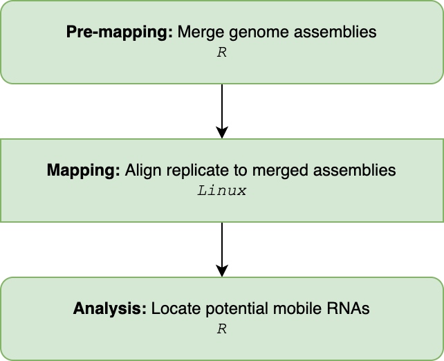
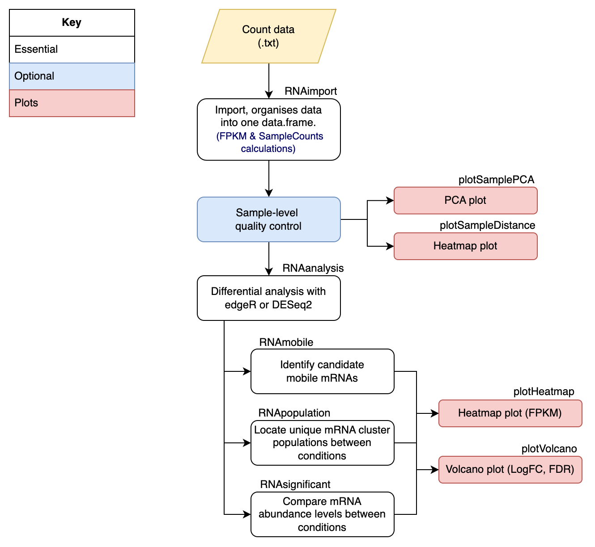

<br>
```{r setup, include = FALSE}
knitr::opts_chunk$set(
  collapse = TRUE,
  fig.align='center',
  external=TRUE,
  echo=TRUE,
  warning=FALSE,
  comment = "#>"
)
```

 
# Introduction

-- mRNA move systematically around plants 
-- known to move across graft junctions 
-- interspecific grafting could lead to movement of forigen mRNAs


# Methods
This manual offers a pipeline for the analysis of mRNAseq data taken from 
chimeric or non-chimeric systems. For example, plant grafting experiments 
between different cultivars and species (with distinct genome assemblies). 
This pipeline involves pre-processing and analysis steps for the identification 
of candidate mobile mRNA molecules and the exploration of population level 
changes in chimeric systems. 

**For chimeric systems: **
To make the best possible prediction of candidate mobile mRNA, here we have 
utilised the optimisations of the mapping algorithm in the pre-processing of 
clean mRNA reads. Here, we supply the mapping algorithms with as much 
information as possible to best place the mRNA in its most likely location 
between two genome assemblies. Hence, this includes supplying two genome 
assemblies at the same time, through the use of a merged genome. 
A merged genome is a single FASTA file containing multiple genome assemblies. 
In many databases, the chromosome names have been consistently named using the 
same patterns. This means that when you merge multiple genome assemblies 
together it is very challenging to distinguish the individual genomes in the 
merged file as they have similar chromosome names. Here, we offer a function to 
merge two genome assemblies or annotations into a single file, and the function
is able to maintain the distinguish-ability by adding a distinct pre-fix to 
chromosome names in each genome. The second piece of extra information we can 
supply th algorithm is a list of all gene loci identified across the sample 
replicates in the analysis. This ensure consistency across the analysis and 
helps prevent false assumptions. Collectively, considering the extra information 
should optimise the alignment of mRNAs to the bets locations within the merged 
genome.  

The analysis is a simple 5-step workflow to identify both candidate mobile mRNAs 
and explore the population-scale dynamics in one. Additional features are 
available and recommend to include in the analysis which includes quality  
control analysis (PCA, comparative heatmap) and plotting of the results as a 
heatmap representing the normalised FPKM and a volcano plot illustrating the 
logfoldchange against the false discovery rate (FDR). When working with a 
chimeric system, mapping error can easily be recognised and required functions
can remove these when specified (see \code[mobileRNA::RNAsignificant()], 
\code[mobileRNA::RNApopulation()] and see \code[mobileRNA::RNAmobile()]). 


Finally, during identification of the candidate mobile molecules (see function 
\code[mobileRNA::RNAmobile()]) the user can set a threshold parameter to either 
result in a more stringent or looser outcomes. The threshold parameter filters 
the data to select a minimum number of replicates in the analysis which 
contained read counts for a locus. This will enable users to select candidate 
mobile mRNAs which are consistently represented across the treatment replicates. 


Here we introduce the use of statistical analysis to identify mobile mRNA 
molecules in chimeric systems, and it should be emphasized that this is an 
optional step. However, statistical analysis for the exploration of population
dynamics should be a mandatory step. Here we include a single 
function which can be instructed to undertake differential analysis using either 
the edgeR or DESeq2 method (see function \code[mobileRNA::RNAanalysis()]). The
function outputs additional columns to your working dataset, including the 
raw count mean, log2FoldChange, p-value and adjusted p-value. 


**For non-chimeric systems: **
Similar to the pre-processing steps for the chimeric system, it is suggest that 
users still employ the first "De Novo mRNA identification" step to assist the 
aligning algorithm. Although, no merged genome will be employed. 

Non-chimeric systems involve a single genotype, hence, the pipeline for 
exploring population-scale mRNA changes is more fitting. This pipeline will 
allow the user to identify mRNA which are statistically more or less abundant 
in the treatment compared to the control and whether any unique populations are
found within either the treatment or the control samples. 

To explore changes in mRNA abundance, we can utilise statistical analysis with 
either `DESeq2` or `edgeR`. For either method, the recommended/standard 
parameter and steps have been employed. The function outputs additional columns 
to your working dataset, including the raw count mean, log2FoldChange, p-value 
and adjusted p-value.  The differences in abundance can be explored by 
extracting statistically significant mRNA-genes from the analysis. 


## Workflow Summary
The summarised workflow is shown below, where it begins in R-Studio to merge 
the two genome assemblies into one, then the pre-processing moves into Linux to 
align each replicate to the merged reference and then back into R-Studio to 
undertake the analysis to identify potentially mobile RNA species.  

```{r, out.width="400", out.height="350", fig.align="centre",  echo=FALSE}


```
<br>


The recommended analysis pipeline in R can be seen below:

```{r, fig.align="centre",  echo=FALSE}
  

```
<br>


# Installation

The latest version of `mobileRNA` can be installed via GitHub
using the `devtools` package:

```{r,  eval=FALSE, message=FALSE}
if (!require("devtools")) install.packages("devtools")
devtools::install_github("KJeynesCupper/mobileRNA", ref = "main")
```

Load package to library:
```{r,  message=FALSE}
library(mobileRNA)
```


## An overview of the data used

For the following examples, a semi-synthetic messenger RNA-seq data set has been 
utilised to simulate the movement of mRNA molecules from an Tomato 
(*Solanium lycopersicum*) rootstock to a Eggplant (*Solanium melongena*) 
scion, a grafting system known to be compatible. 

* The three heterograft replicates: known as:`heterograft_1`, `heterograft_2` & `heterograft_3` are individual tomato replicates spiked with 150 tomato sRNA clusters. 

* The self-graft replicates: known as `selfgraft_1`, `selfgraft_2` & `selfgraft_3`, are the individual tomato replicates without the spiked tomato sRNA clusters. 


The replicates mirror each other where, for instance, `heterograft_1` 
and `selfgraft_1` are the same replicate, either with or without the spiked 
clusters. These replicates serve for the aim to analyse mRNA mobility. 

The data set, called `mRNA_data`, stores a matrix containing the
pre-processed data from the experiment. As a
user, this allows you to see what a full data set might look like and how
you might expect it to change across the analysis. Please not that the data 
has been doctored to reduce the size of the file. 

These can be loaded in these R workspace by using the following command:


```{r Load,eval=FALSE, message=FALSE}
data("mRNA_data")
```
<br>

## Data organisation
There are two key elements required for the pipeline analysis:
* sRNA-seq sample replicates  (.fastq/.fq)
* Two reference genomes (.fasta/.fa)

And one additional element; to improve functional analysis:
* Reference genome annotations (.gff/.gff3)
<br>
<br>

### Naming data files

It is recommended to rename your files to names you wish for them to
be represented as within the analysis and shown as labels in plots.
Plus, it makes the analysis easier!

For example, instead of names such as:

- 1: `sample_1.fq`
- 2: `sample_2.fq`
- 3: `sample_3.fq`
- 4: `sample_4.fq`
- 5: `sample_5.fq`
- 6: `sample_6.fq`

For the example data set included in the package, here we have renamed the
files based on the condition (treatment or control).For the hetero-grafts, where 
the is a eggplant scion and an tomato rootstock:

- 1: `heterograft_1.fq`
- 2: `heterograft_2.fq`
- 3: `heterograft_3.fq`

and for the eggplant self-grafts:

- 4: `selfgraft_1.fq`
- 5: `selfgraft_2.fq`
- 6: `selfgraft_3.fq`
<br>


### The reference genomes and annotation files (.fasta/.fa)
The pipeline is designed to analyse grafting systems with two
distinct genomes, here tomato and eggplant.
<br>


# Pre-Processing
The pre-processing step involves cleaning raw data and aligning data to the
merged genome.  Going forward, the pipeline has assumed that the mRNA-seq 
samples have met quality control standards.

We recommend installing and using the ...

Here, we introduce an alternative mapping method for the analysis of plant
heterograft samples. The heterograft system involves two genotypes; here
the two genome references are merged into a single reference to which
samples are aligned to.

`mobileRNA` offers a function to merge two FASTA reference genomes into one.
To distinguish between the reference genomes in a merged file, it is important
to make sure the chromosome names between the genomes are different and
distinguishable. The function below added a particular character string to the
start of each chromosome name in each reference genome. As standard, the string
`A_` is added to the reference genome supplied to `genomeA` and `B_` is added
to the reference genome supplied to `genomeB.` These can be customized to the
users preference, see manual for more information.
<br>

## Pre-mapping
Here we will merge two genome assemblies or annotations into a merged file. 
It is of the most importance that both the merged genome and merged annotation 
contained the same modifications to the chromosome names. 

### Merging Genome Assemblies
Here we merge the two reference genomes into a single merged genome using the
[mobileRNA::RNAgenomeMerge()] function. As default, this function changes the
chromosome names of each genome to ensure they are distinguishable. To do so,
the function requires an input of the initials of each organism's Latin name.
But why do this:

* If the two genomes use the same pattern to name the chromosomes, the user will not be able to differentiate the chromosomes from one another in the merged genome. This could be solves by adding letters to the chromosomes of one of the genomes, for example, `SM` to represent the Latin name of eggplant.

* If a chromosome naming pattern contains punctuation, the mapping step will not work.


In the example, the *Solanum lycopersicum* (version 4) genome contains a
full-stop/period within each chromosome name which needs to be removed as well.
Here we rename the chromosomes of the tomato genome to `SL` and the chromosomes
related to the eggplant genome (*Solanum melongena*) to `SM`.

```{r, eval = FALSE}
RNAmergeGenomes(genomeA ="/Users/user1/projectname/workplace/reference/ref1.fa",
               genomeB ="/Users/user1/projectname/workplace/reference/ref2.fa",
               abbreviationGenomeA = "SL",
               abbreviationGenomeB = "SM",
               out_dir = "/Users/user1/projectname/workplace/reference/merge/
               ref_merged.fa")
```

## Merging Genome Annotations
To assist the processing of raw count files, the genomic annotation files (GFF) 
of each reference genome must be merged in the same way the reference genomes 
were. This includes following the same naming patterns for
the chromosomes in each genome as undertaken earlier with the `RNAmergeGenomes()`
function. To undertake a similar merging between the two GFF files, use the
`RNAmergeAnnotations` function.

```{r, eval = FALSE}
## merge the annotation files into a single annotation file
RNAmergeAnnotation(annotationA = "/Users/user1/projectname/workplace/
                   annotation/annotation_1.gff3",
                   annotationB = "/Users/user1/projectname/workplace/
                   annotation/annotation_1.gff3",
                   abbreviationAnnoA = "SL",
                   abbreviationAnnoB = "SM"
                  out_dir = "/Users/user1/projectname/workplace/
                  annotation/merge/anno_merged.gff")

```

## Auto-Detection of mRNA loci
Here we identify and build a list mRNA loci within each sample to assist
the mapping step later on to ensure consistency across the analysis. This step
is very important to consider in the analysis as it prevents false assumptions. 
This step aligns a replicate to the given genome assembly and the
output contains loci where mRNA reads aligned. 

#### Step 1 - Cluster analysis with ShortStack

``` bash


```


#### Step 2 - Build sRNA cluster list 

Now, we collate all the mRNA loci information from each sample into a text file. 

``` r

```


## Mapping   

Each sample is mapped to the merged reference genome with the list of mRNA 
clusters. 


``` bash


```

<br>

## Raw count generation    


``` bash


```

<br>

# Analysis
Here, the analysis of the pre-processed data occurs, with the aim to
identify if any mobile mRNA molecules and population-scale mRNA changes in 
(non)chimeric systems. 
<br>

## Import Data
In the pre-processing steps, the data was cleaned and aligned to
the merged reference genome. During the mapping step, a folder for each sample
is created which stores all the results in. The analysis steps requires the
information which is stored in the `Results.txt`.

The `RNAimport()` function imports the data from the folder containing
all sample folders. The function extracts the required information, stores it
in a matrix.

The function requires some information to coordinate the importation and
calculations. It requires a directory path to your processed samples;
this is the path to the folder containing all the
individual sample folders which is stores in argument `directory`. The second
directory path is to the loci file containing information on the loci of the
sRNA clusters across the analysis, stored in the argument `loci`.
The last pieces of information the function requires a vector containing the
sample names, both treatment and control replicates which is stored in the argument
`samples`. The sample names must match the names of the folders produced in
the mapping, and stored in the directory supplied to the argument `directory`.


```{r, eval = FALSE, message=FALSE}
## Import & organise data.
results_dir <-  "./analysis/alignment_unique_two/"
sample_names <- c("heterograft_1","heterograft_2", "heterograft_3",
                  "selfgraft_1", "selfgraft_2", "selfgraft_3")


mRNA_data <- RNAimport(input = "mRNA",
                       annotation = "./annotation/merged_anno.gff",
                       directory = results_dir,
                       samples = sample_names)

```

```{r, eval=FALSE}
data(mRNA_data)
# example dataframe 
head(mRNA_data)
```

<br>

## Sample-level quality control
A handy step in the analysis is to assess the overall similarity between
sample replicates to understand which samples are the most similar and which are
different, and where the most variation is introduced in the data set.
As well as understanding whether the data set meets your expectations.
It is expected that between the conditions, the sample replicates show
enough variation to suggest that the replicates are from different groups.

To investigate the sample similarity/difference, we will undertake sample-level
quality control using three different methods:
- Principle component analysis (PCA)
- Hierarchical clustering Heatmap

This will show us how well samples within each condition cluster together, which
may highlight outliers. Plus, to show whether our experimental conditions
represent the main source of variation in the data set.

Here we will be employing an unsupervised clustering methods for the PCA and
hierarchical clustering Heatmap. This involves an unbiased log2-transformation of
the counts which will emphasis the the sample clustering to improve
visualization. The DESeq2 package contains a particularly useful function to
undertake regularized log transformation (rlog) which controls the variance
across the mean, and in this package we have utilized this for the quality
control steps.

<br>

### Principle component analysis to assess sample distance
Principal Component Analysis (PCA) is a useful technique to illustrate sample
distance as it emphasizes the variation through the reduction of dimensions in
the data set. Here, we introduce the function `plotSamplePCA()`

```{r, echo=FALSE}
cap3 <-"An example of a PCA, illustracting the sRNA data set sample similarity"

```

```{r, eval=FALSE,message=FALSE, fig.cap=cap3, fig.show="hold"}

group <- c("Heterograft", "Heterograft", "Heterograft",
            "Selfgraft", "Selfgraft", "Selfgraft")

plotSamplePCA(mRNA_data, group)

```

### Hierarchical clustered heatmap to assess sample distance

Similarly, to a PCA plot, the `plotSampleDistance()` function undertakes
hierarchical clustering with an unbiased log transformation to calculate sample
distance and is plotted in the form of a heatmap.

```{r,eval=FALSE, echo=FALSE}
cap4 <-"An example of a heatmap,illustracting the sRNA data set sample similarity"

```
```{r ,eval=FALSE, message=FALSE, fig.cap=cap4, fig.show="hold"}
plotSampleDistance(mRNA_data)

```
<br>


## Differential Expression analysis with DESeq2 or edgeR
Differential expression (DE) analysis is undertaken to identify mRNA which are
statistically significant to discover quantitative changes in the expression
levels between the treatment (hetero-grafting) and the control (self-grafting)
groups. This technique can be undertaken with a variety of tools, in `mobileRNA`
users have the option to use the `DESeq2` or `edgeR` analytical method.

In particular case, one method may be preferred over the other.
For instance, the `DESeq2` method is not appropriate when the experiment does not
contain replicate (ie. one sample replicate per condition). On the other hand,
edgeR can be used. Here, we have included the recommend practice for edgeR when
the data set does not contain replicates. This option can be employed by setting
a custom dispersion value, see argument `dispersionValue`.


```{r DEprep,eval=FALSE, message = FALSE, warning = FALSE}
# sample conditions in order within dataframe
groups <- c("Heterograft", "Heterograft", "Heterograft",
            "Selfgraft", "Selfgraft", "Selfgraft")


## Differential analysis of whole dataset: DEseq2 method 
mRNA_DESeq2 <- RNAanalysis(data = mRNA_data,
                              group = groups,
                              method = "DESeq2" )

## Differential analysis of whole dataset: edgeR method 
mRNA_edgeR <- RNAanalysis(data = mRNA_data,
                              group = groups,
                              method = "edgeR" )


```

<br>

## Identify the mobile molecules
It is essential to remove the noise from the data to isolate potential mobile
molecules through the removal mRNA molecules which map to the tissue-origin 
genotype, and mapping errors. 

To remove molecules mapped to a specific genome set the `"task"` parameter to 
"remove", while to keep molecules mapped to a specific genome set as "keep".
The function can also consider statistical significance filter, whereby mRNA 
molecules can be selected based on an adjusted p-value threshold, which by 
default is set to 0.05. Similarly, if you would prefer to extract the mobile 
mRNA based on the p-value, rather than the adjusted p-values, a numeric 
threshold can be set for the argument `p.value` which will override the adjusted
p-value settings. As default, the function does not consider
the statistical values and properties of the sRNAs. To consider, use 
`statistical=TRUE`

```{r ,eval=FALSE,message=FALSE}
# vector of control names
control_names <- c("selfgraft_1", "selfgraft_2", "selfgraft_3")


## Identify potential tomato mobile molecules, before subsetting classes
mobile_mRNA <- RNAmobile(data = mRNA_DESeq2, 
                         controls = control_names,
                         genome.ID = "SL40",
                         task = "keep", 
                         statistical = FALSE)


```
<br>


### Heatmap plots to represent mobile molecules
Here we can use a heatmap created using the FPKM values for each sample. The
function normalises the FPKM values and undertakes a log transformation before
plotting. 

<br>

### Mobile molecules from the 24-nt sRNA dataset
```{r, eval=FALSE,echo=FALSE}
cap7 <- "An example heatmap of cadidate mobile mRNA molecules"

```

```{r,eval=FALSE,fig.cap=cap7, fig.show="hold", out.width="50%", fig.subcap= c("A","B") }
p10 <- plotHeatmap(mobile_mRNA)
```

<br>

### Save output 

```{r, eval = FALSE}
write.table(mobile_sRNA, "./output.txt")
```
<br>


## Explore population-scale sRNA differences
Here, we will look at comparing the native population of mRNAs and how they 
might have changes in the tissue due to the chimeric system compared to the 
control. 

We have already undertaken the statistical analysis in the previous steps, we
will be utilising this dataset going forward.

### sRNA abundance 
When comparing treatment to control conditions, it might be the case that 
the same mRNA are found within both but there are differences in the total 
abundance. 

The statistical analysis calculated the log2FC values for each mRNA by 
comparing the normalised counts between treatment and control. Here, 
a positive log2FC indicates an increased abundance of transcripts for a given 
mRNA in the treatment compared to the control, while negative log2FC 
indicates decreased abundance of transcripts. The statistical significance of 
the log2FC is determined by the (adjusted) pvalue also calculated in the 
previous step. 

Here we will filter the data to select sRNA clusters which are statistically 
significant, and then plot the results as a heatmap to compare the conditions. 
```{r, eval=FALSE}
# select only significant sRNAs
significant_mRNAs <- RNAsignificant(mRNA_DESeq2)


#plot
p1 <- plotHeatmap(significant_mRNAs, cluster = FALSE, row.names = FALSE)

```

Lets look at the plot:

```{r, eval=FALSE}
p1$plot 
```
<br>

## Step 6: Identify absolute mRNA population difference 
Finally, the  `RNApopulation()` function can be utilised to identify unique 
mRNA populations found in the treatment or control condition.


First lets look at the mRNAs which are unique to the treatment condition.
In the chimeric heterografts, we expect that the foreign sRNAs will also be 
selected in this pick-up, therefore, we can use the parameter `genome.ID` to 
remove mRNA related to the foreign genome. 


```{r, eval=FALSE}
# select sRNA clusters only found in treatment & not in the control samples
treatment_reps <- c("heterograft_1", "heterograft_2" , "heterograft_3")
unique_treatment <- RNApopulation(data = mRNA_DESeq2, 
                                  conditions = treatment_reps)

# look at number of sRNA cluster only found in treatment 
nrow(unique_treatment)
```


Now, the mRNAs that are unique to the control condition:
```{r, eval=FALSE}
# select sRNA clusters only found in control & not in the treatment samples
control_reps <- c("selfgraft_1", "selfgraft_2" , "selfgraft_3")
unique_control <- RNApopulation(data = mRNA_DESeq2, 
                                   conditions = control_reps)
# look at number of sRNA cluster only found in control  
nrow(unique_control) 
```
<br>

Several plotting functions within the package can be used to display these 
results, specifically \code[plotVolcano()] and \code[plotHeatmap()].


# Session information
```{r}
sessionInfo()
```